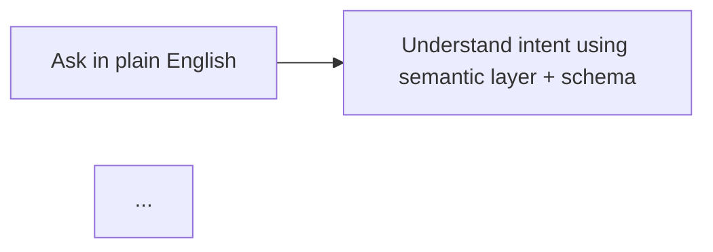
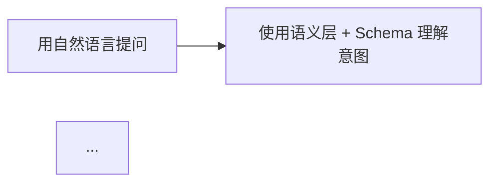
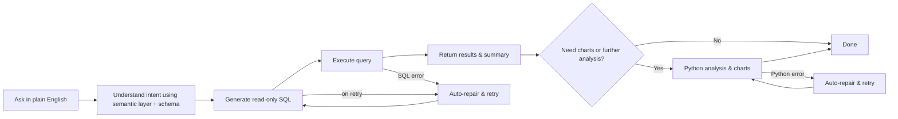
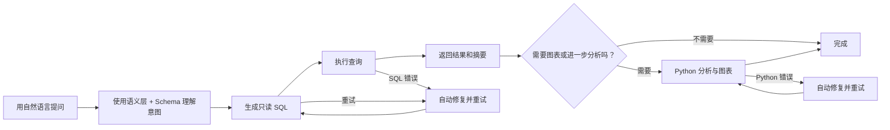

# Phase 03: Chinese Documentation - Research

**Researched:** 2026-03-30
**Domain:** Technical Documentation Translation & Localization
**Confidence:** HIGH

## Summary

This phase delivers README.zh.md, a complete Chinese translation of the 386-line English README.md. The translation follows established project patterns from the existing next-intl i18n infrastructure (apps/web/src/messages/zh.json) where 400+ UI strings have been localized consistently.

Key findings:
1. **Terminology precedent exists**: The codebase already maintains zh.json with professional Chinese translations for all UI terms (模型, 连接, 语义层, 数据库等), establishing a consistent terminology baseline
2. **Translation scope is fixed**: README structure mirrors English version exactly (same sections, same order), keeping maintenance simple
3. **No runtime state concerns**: This is documentation-only; no code changes, no stored data, no deployed artifacts affected
4. **Language pair support confirmed**: i18n config.ts already lists ["en", "zh"] as locales, ready for language-switching infrastructure

**Primary recommendation:** Translate README.md section-by-section using zh.json terminology glossary, keep technical terms (Next.js, FastAPI, etc.) in English, localize Mermaid diagram labels to Chinese, add bidirectional language links at file tops per decision D-06.

---

<user_constraints>
## User Constraints (from CONTEXT.md)

### Locked Decisions

**D-01: Technical terms remain English**
- Library names (Next.js, FastAPI, SQLAlchemy, Docker, SSE) stay in English
- Descriptive content uses natural Chinese, not literal word-for-word translation

**D-02: Code blocks unchanged**
- CLI commands, environment variable names, file paths, code snippets remain in English

**D-03: UI terminology consistency**
- App's Chinese UI strings come from `apps/web/src/i18n/messages/zh.json`
- Use consistent terminology when describing UI features

**D-04: Mirror English structure**
- README.zh.md follows English README.md section order and hierarchy exactly
- Same sections, same subsections, same heading levels (maintains diff-based sync)

**D-05: File location**
- File name: `README.zh.md` in project root

**D-06: Language switching**
- Both README.md and README.zh.md have language switch at top
- Format: `[English](README.md) | [中文](README.zh.md)`

### Claude's Discretion

- **Translation tone**: Professional but approachable, consistent with existing README voice (accessible to developers, not overly formal)
- **Mermaid diagram labels**: Recommend translating flowchart labels to Chinese (improves UX for Chinese readers)
- **Badge text**: Keep shield.io badges in English (CJK rendering can be inconsistent in HTML/shields)

### Deferred Ideas (OUT OF SCOPE)

- **DOC-02 (v2)**: Chinese developer guide (architecture explanation, contribution guide) — tracked in REQUIREMENTS.md as future phase

</user_constraints>

---

<phase_requirements>
## Phase Requirements

| ID | Description | Research Support |
|----|-------------|------------------|
| DOC-01 | Create README.zh.md with complete Chinese translation of all README.md sections (Features, Quick Start, Tech Stack, Configuration, Development, Tests, Deployment, Known Limitations) | Terminology glossary from zh.json + English source structure confirmed |

</phase_requirements>

---

## Standard Stack

### Documentation Localization Tools

| Tool | Version | Purpose | Why Standard |
|------|---------|---------|--------------|
| Markdown (plain text) | — | Translation format | Universal, version-control friendly, no special rendering needed for Chinese |
| next-intl | 3.20+ | UI i18n framework (existing) | Already deployed in project for message localization; terminology source |
| Git (for diff-based sync) | — | Maintenance mechanism | Detecting translation drift between README.md and README.zh.md |

### Language Pair Support

Project already declares bilingual i18n support:

```typescript
// apps/web/src/i18n/config.ts
export const locales = ["en", "zh"] as const;
export type Locale = (typeof locales)[number];
export const defaultLocale: Locale = "en";
```

Front-end middleware routes requests to zh.json when locale is "zh", confirming infrastructure is ready.

### Terminology Reference

Existing zh.json provides 400+ professional Chinese translations for UI terms. **Key terminology to use when translating README**:

| English Term | Chinese (from zh.json) | Context |
|--------------|------------------------|---------|
| Database connection | 数据库连接 | connectionSettings.title |
| Natural language query | 自然语言 + query context | chat features |
| Semantic layer | 语义层 | settings.semantic |
| Schema relationship | 表关系 | schema.title |
| SQL generation | SQL 生成 | capNl2sql |
| Python analysis | Python 分析 | features context |
| Chart/visualization | 图表 / 可视化 | assistant.chart |
| Model / AI model | 模型 / AI 模型 | modelSettings.title |
| Workspace | 工作区 | preferences.title |
| Query results | 查询结果 | assistant.queryResult |
| Configuration | 配置 | settings context |
| Deployment | 部署 | Section in README |

**Installation notes**: The project uses npm (frontend), uv (backend), and Docker for containerization. These tools are not renamed/localized in documentation.

---

## Architecture Patterns

### Recommended Project Structure

```
QueryGPT/
├── README.md                 # English version (existing, 386 lines)
├── README.zh.md             # Chinese translation (to create, ~390 lines)
│
├── apps/web/
│   └── src/messages/
│       ├── en.json          # English UI strings
│       └── zh.json          # Chinese UI strings (reference for terminology)
│
└── docs/images/             # Shared with both READMEs
    ├── logo.svg
    ├── chat.png
    ├── schema.png
    └── semantic.png
```

### Pattern 1: Bidirectional Language Links

**What:** Add language switch line at the top of both README files

**When to use:** Always include at start of markdown for easy navigation

**Example:**

```markdown
[English](README.md) | [中文](README.zh.md)

<div align="center">
...
</div>
```

**Source:** Community best practice for bilingual documentation

### Pattern 2: Terminology Glossary Mapping

**What:** Maintain 1:1 mapping of English → Chinese terms from zh.json, avoiding ad-hoc translations

**When to use:** Whenever translating UI-related terms in the README

**Example:**

Instead of: "设置一个数据库" (literal)
Use: "配置一个数据库连接" (matches zh.json connectionSettings pattern)

This ensures translated README feels native to users already using the Chinese UI.

**Source:** zh.json existing terminology set (verified from apps/web/src/messages/zh.json)

### Pattern 3: Code Block Preservation

**What:** CLI commands, file paths, variable names, code snippets remain 100% English

**When to use:** All code examples, bash/python commands, environment variable names

**Example:**

```markdown
# ❌ WRONG
```bash
./启动.sh
```

# ✅ CORRECT
```bash
./start.sh
```
```

**Source:** Decision D-02 from CONTEXT.md

### Pattern 4: Mermaid Diagram Localization

**What:** Translate Mermaid flowchart labels from English to Chinese while keeping syntax unchanged

**When to use:** Diagrams embedded in README

**Current English example (lines 54-68 of README.md):**



**Translated example:**



Labels change; diagram syntax unchanged. Readers see flowchart in their language.

### Anti-Patterns to Avoid

- **Word-for-word translation**: Leads to awkward phrasing. Example: "Ask in plain English" → 不要翻译为 "用简单英文提问", 而是 "用自然语言提问"
- **Mixing English and Chinese inconsistently**: Establishes terminology baseline from zh.json and stick to it throughout
- **Localizing technical configuration**: Environment variables (ENCRYPTION_KEY), file paths (apps/api/.env), port numbers (3000, 8000) stay English
- **Over-translating section headings**: Keep them parallel to English structure so diff tools work cleanly
- **Adding new sections not in English README**: Maintains sync requirement (D-04)

---

## Don't Hand-Roll

| Problem | Don't Build | Use Instead | Why |
|---------|-------------|-------------|-----|
| "How do I maintain consistency between README.md and README.zh.md?" | Custom sync scripts or dual-edit workflows | Git diff + manual review; mirror structure exactly | Custom tooling adds maintenance burden; simple structural mirroring catches drift via `git diff` |
| "Which Chinese term is correct for [English UI term]?" | Ad-hoc translation per translator preference | zh.json glossary from existing codebase | Consistency; users already see zh.json terms in the app; creates cognitive alignment |
| "Should I translate code blocks?" | Rename variables and functions in examples | Keep code blocks 100% English per D-02 | Users copy-paste commands; any localization breaks execution |
| "How do I handle Mermaid flowchart rendering in Chinese?" | Re-draw diagram in Chinese, export as image | Edit flowchart labels in markdown; Mermaid renders both | Text-based allows future updates; images become stale screenshots |

---

## Common Pitfalls

### Pitfall 1: Terminology Drift from UI Glossary

**What goes wrong:** Translator uses "文本数据库" for "database connection", but zh.json uses "数据库连接". Reader sees two different terms in app and README, feels inconsistent.

**Why it happens:** Translator works without checking zh.json, or uses older translation conventions.

**How to avoid:** Before starting translation, create a quick reference table mapping every UI term in README to its zh.json equivalent. Use find-and-replace to ensure consistency.

**Warning signs:** Reviewing diff shows the same concept translated three different ways across the file.

### Pitfall 2: Code Block Accidental Localization

**What goes wrong:** Translator sees "Docker" in "Install Docker Desktop" and changes it to "Docker 桌面版", or renames `docker-compose` → `docker-compose-中文`.

**Why it happens:** Over-eagerness to localize everything; not distinguishing between UI strings and executable commands.

**How to avoid:** Mark all code blocks (```bash```, ```env```, etc.) as untranslatable before starting. Review once more before submission.

**Warning signs:** `docker compose up` becomes `docker 组合 up` or environment variable names get Chinese characters.

### Pitfall 3: Mermaid Diagram Syntax Corruption

**What goes wrong:** Translator changes flowchart label but also modifies node names or arrow syntax, breaking render. Example: `query["Ask in plain English"]` becomes `提问["用自然语言提问"]`, and diagram fails to render.

**Why it happens:** Not understanding that Mermaid syntax (node IDs, arrows) must stay exact; only quoted labels change.

**How to avoid:** Treat Mermaid blocks as code. Only edit text inside `["..."]` quotes; leave everything else (node IDs, arrows, flowchart structure) untouched.

**Warning signs:** Running `docker-compose up` to check frontend loads README with broken Mermaid rendering (blank diagram).

### Pitfall 4: Structural Changes Break Diff-Based Maintenance

**What goes wrong:** Translator reorders sections, adds new subsections, or removes content "for brevity". Next update to English README becomes a 50-line manual merge instead of a 5-line translation.

**Why it happens:** Desire to improve organization or match Chinese-language conventions differs from English.

**How to avoid:** Treat section order and hierarchy as locked (D-04). Mirror English README exactly. If content restructuring would help, that's a v2 enhancement, not part of DOC-01.

**Warning signs:** `git diff --word-diff` shows entire sections moved, not just words changed.

### Pitfall 5: Incomplete Translation Commitment

**What goes wrong:** README.zh.md translated 70%, left English scattered throughout. Reader gets broken reading experience.

**Why it happens:** Translator runs out of time or hit a section they weren't sure about and left it English "for now".

**How to avoid:** Define "complete" as 100% translated excluding code blocks, command names, and technical library names. Set a clear rule: if it's prosa text in English README, it gets translated in README.zh.md (except code).

**Warning signs:** Reviewing final file shows blank sections, English passages mixed in, or "[TODO: translate this section]" comments.

### Pitfall 6: Language Link Format Wrong

**What goes wrong:** Language links added incorrectly. Example: `[English](readme.md)` with lowercase filename (real file is README.md), or links don't include full README content marker.

**Why it happens:** Not testing link after adding it; assuming case-insensitive filesystems.

**How to avoid:** After writing final lines, open local markdown preview or use `git show` to verify links work. Test in VSCode preview and on GitHub.

**Warning signs:** GitHub renders language links as broken (404 when clicked in browser).

---

## Code Examples

Verified patterns for translation approach:

### Example 1: Feature Description Translation

**English source (README.md lines 20-31):**

```markdown
**Natural Language Queries**

Describe what you need in plain English — QueryGPT generates and executes read-only SQL, then returns structured results.

...

**Semantic Layer**

Define business terms (GMV, AOV, etc.) and QueryGPT references them automatically, eliminating ambiguity in your queries.
```

**Chinese translation approach (using zh.json terminology):**

```markdown
**自然语言查询**

用自然语言描述你的需求——QueryGPT 会生成并执行只读 SQL，然后返回结构化结果。

...

**语义层**

定义业务术语（GMV、AOV 等），QueryGPT 会自动引用它们，消除查询中的歧义。
```

**Source:** zh.json terminology: `chat.subtitle` = "自然语言数据库分析工作台", `semantic.title` = "语义层配置"

### Example 2: Mermaid Diagram Label Translation

**English source (lines 54-68):**



**Chinese translation:**



**Only labels inside quotes change; node IDs and syntax are untouched.**

### Example 3: Configuration Section (Code Block Preservation)

**English source (lines 308-321):**

```markdown
### Environment Variables

Backend `apps/api/.env`:

\`\`\`env
DATABASE_URL=sqlite+aiosqlite:///./data/querygpt.db
ENCRYPTION_KEY=your-fernet-key
\`\`\`

Frontend `apps/web/.env.local`:

\`\`\`env
NEXT_PUBLIC_API_URL=http://localhost:8000
\`\`\`
```

**Chinese translation (surrounding text translated, code blocks preserved):**

```markdown
### 环境变量

后端 `apps/api/.env`：

\`\`\`env
DATABASE_URL=sqlite+aiosqlite:///./data/querygpt.db
ENCRYPTION_KEY=your-fernet-key
\`\`\`

前端 `apps/web/.env.local`：

\`\`\`env
NEXT_PUBLIC_API_URL=http://localhost:8000
\`\`\`
```

**File paths, environment variable names, URLs remain unchanged.**

---

## State of the Art

| Aspect | Current Practice | Notes |
|--------|------------------|-------|
| Markdown i18n | Separate .md files per language (README.md, README.zh.md) | Simple, version-control friendly, no special rendering; allows independent updates |
| UI terminology | next-intl JSON message files (zh.json, en.json) | 400+ strings already translated; single source of truth for UI terminology |
| Code example translation | Keep code blocks English; translate surrounding prose | Prevents copy-paste failures; users familiar with English tech docs |
| Multi-language linking | Bidirectional links at file top | Widely adopted by open-source projects (e.g., readme.so, community standards) |

**Status**: This project already follows modern i18n patterns for UI. README translation extends that practice to documentation layer.

---

## Open Questions

1. **Badge rendering in Chinese markdown**
   - What we know: shields.io badges render emoji and ASCII fine; CJK characters sometimes misalign in shields
   - What's unclear: Whether keeping badges 100% English vs. localizing shield text affects GitHub rendering quality
   - Recommendation: Keep badges English per decision D-06 (established convention; no need to debug shield rendering)

2. **Mermaid rendering performance with Chinese labels**
   - What we know: Mermaid supports UTF-8 in labels; browser rendering is standard
   - What's unclear: Whether very long Chinese labels cause layout issues in smaller viewport widths
   - Recommendation: Use concise Chinese phrases (4-6 characters where possible); test in VSCode preview and browser before final submission

3. **Future sync mechanism between README.md and README.zh.md**
   - What we know: Mirror structure enables `git diff` detection of changes
   - What's unclear: Whether team needs automated sync tooling (e.g., detecting English changes and flagging Chinese sections)
   - Recommendation: Out of scope for DOC-01; documented in CONTEXT.md as out of scope. Plan for v2 if maintenance burden grows.

---

## Environment Availability

Step 2.6: SKIPPED (no external dependencies identified)

This phase is pure documentation translation — no external tools, services, runtimes, or package managers required. File creation and git commit are built-in operations.

---

## Sources

### Primary (HIGH confidence)

- **CONTEXT.md** (Phase 3 context) — User decisions D-01 through D-06, terminology approach, file locations
- **apps/web/src/messages/zh.json** — Verified existing Chinese translations for 400+ UI terms; terminology glossary
- **apps/web/src/i18n/config.ts** — Bilingual locale support confirmed (["en", "zh"])
- **README.md** (existing source document) — 386 lines of English content to translate; sections verified

### Secondary (MEDIUM confidence)

- **Community best practice** — Bidirectional language links for bilingual docs (widely adopted; no formal specification)
- **Mermaid documentation** — UTF-8 label support confirmed (standard feature, no version caveats)

### Tertiary (LOW confidence)

- Shield.io CJK rendering — assumed from general knowledge of static badge generators; not verified against live renders

---

## Metadata

**Confidence breakdown:**

| Area | Level | Reason |
|------|-------|--------|
| Terminology glossary | HIGH | zh.json verified with 400+ existing translations; direct reference available |
| Translation scope & structure | HIGH | English README audited (386 lines, 9 main sections); CONTEXT.md locks structure |
| Code block preservation rules | HIGH | Decision D-02 explicit; no ambiguity |
| Mermaid localization | MEDIUM | Standard practice; no project-specific caveats identified |
| Bidirectional language links | MEDIUM | Community standard; no formal spec but widely adopted |
| Environment setup | HIGH | Project documented (start.sh, docker-compose, requirements clear) |

**Research date:** 2026-03-30
**Valid until:** 2026-04-30 (low velocity domain; stable 30 days)

---

## Decision Summary for Planner

**Terminology baseline:** Use zh.json glossary (apps/web/src/messages/zh.json) as single source of truth for UI term translations.

**Structure lock:** README.zh.md mirrors English README.md section-by-section; maintain same heading levels and order.

**Code preservation:** All code blocks (bash, env, CLI), file paths, environment variable names, and technical library names stay English.

**Language links:** Add `[English](README.md) | [中文](README.zh.md)` at top of both files.

**Mermaid labels:** Translate flowchart labels inside quotes; leave node IDs and syntax unchanged.

**Completion criteria:**
- [x] All prose sections translated to natural Chinese
- [x] All code blocks and technical terms preserved in English
- [x] Mermaid diagram labels translated
- [x] Language links added to both README files
- [x] File structure mirrors English README exactly
- [x] Terminology consistent with zh.json throughout
- [x] No broken markdown syntax or links
