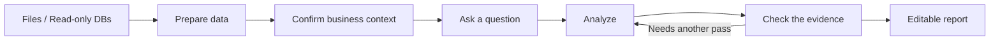

<div align="center">


# ReceiptBI

**Turn CSV, Excel, and read-only databases into reports you can verify and edit.**

Investigate data in plain language, keep the evidence, and organize confirmed findings into reports.

[Download the desktop app](https://github.com/MoonMao42/ReceiptBI/releases/latest) · [Try the sample](#try-the-sample) · [中文](README.md)

[](https://github.com/MoonMao42/ReceiptBI/actions/workflows/ci.yml)
[](https://github.com/MoonMao42/ReceiptBI/releases/latest)
[](LICENSE)

</div>


<p align="center"><sub>Recorded in the real app with the 12-row synthetic order sample included in this repository.</sub></p>

Many data tools stop after answering one question. ReceiptBI keeps the question, source data, business definitions, calculations, and findings in the same investigation. You can inspect the evidence and keep working with the result in an editable report.

## Try the sample

1. Install the [ReceiptBI desktop app](https://github.com/MoonMao42/ReceiptBI/releases/latest), or run it from source.
2. Download the [coffee retail order sample](examples/retail/orders.csv).
3. Choose a model provider in Settings, then add the sample file to your project.
4. Ask:

> Analyze sales, gross profit, and refunds for the latest month. Compare regions and channels.

The sample contains 12 synthetic rows and no names, addresses, accounts, or other personal information. It is small enough to show the full path from an investigation to a paginated report in a few minutes.

## Download

The current desktop version is [ReceiptBI 1.0.0](https://github.com/MoonMao42/ReceiptBI/releases/tag/v1.0.0).

| System | Installer |
|---|---|
| macOS, Apple silicon | [Download DMG](https://github.com/MoonMao42/ReceiptBI/releases/download/v1.0.0/ReceiptBI-1.0.0-mac-arm64.dmg) |
| macOS, Intel | [Download DMG](https://github.com/MoonMao42/ReceiptBI/releases/download/v1.0.0/ReceiptBI-1.0.0-mac-x64.dmg) |
| Windows x64 | [Download installer](https://github.com/MoonMao42/ReceiptBI/releases/download/v1.0.0/ReceiptBI-1.0.0-win-x64.exe) |

Installer checksums are available in [SHA256SUMS](https://github.com/MoonMao42/ReceiptBI/releases/download/v1.0.0/SHA256SUMS).

<details>
<summary><strong>First launch on macOS</strong></summary>

1. Open the DMG and move ReceiptBI to Applications.
2. The current 1.0.0 build is unsigned. If macOS blocks the first launch, run:

```bash
xattr -cr /Applications/ReceiptBI.app
```

</details>

## More than a one-off answer

### Keep the question and evidence together

Each investigation keeps the original question, relevant data, findings, charts, and follow-up work in one place. When a business definition is unclear, you can confirm it before the analysis continues.


### Keep business definitions with the right data

ReceiptBI stores source purpose, field meanings, metrics, and relationships with the data they describe. A table-level definition only applies inside that table. Cross-table analysis uses confirmed relationships to combine those scopes.


### Continue from findings to an editable report

Choose an investigation, review the suggested content and order, then create a report draft. Reports remain editable and paginated, and existing manual edits are not silently overwritten.


### See the real page breaks before export

Preview shows the actual pagination before printing or export, so metrics, charts, and source references remain readable.


<div align="center">

**If ReceiptBI has saved you from rebuilding one report by hand, a Star helps.**

[⭐ Star ReceiptBI](https://github.com/MoonMao42/ReceiptBI)

</div>

## How it works



Confirmed preparation steps and business definitions can be reused. When the data changes but its structure does not, the same definitions can support another investigation and a refreshed report.

## Supported today

| Area | Support |
|---|---|
| Files | CSV, XLS, XLSX, Parquet, JSON |
| Databases | SQLite, MySQL, PostgreSQL with read-only connections |
| Model providers | OpenAI-compatible APIs, Anthropic, DeepSeek, Ollama, custom gateways |
| Report content | Metrics, text, tables, charts, sources, paginated preview |

## Run from source

macOS and Linux require Python 3.11+ and Node.js LTS:

```bash
git clone https://github.com/MoonMao42/ReceiptBI.git
cd ReceiptBI
./start.sh
```

Docker is also supported:

```bash
docker compose up --build
```

Open `http://localhost:3000`, choose a model provider, and add your data.

<details>
<summary><strong>Development notes</strong></summary>

### Common commands

```bash
./start.sh              # Start the frontend and backend
./start.sh setup        # Install dependencies
./start.sh stop         # Stop the services
./start.sh test         # Run tests
```

### Stack

| Part | Technology |
|---|---|
| Frontend | Next.js 15, React 19, TypeScript |
| Backend | FastAPI, Python 3.11+, PydanticAI |
| Desktop | Electron, Rust |
| Data processing | DuckDB, native database adapters |

</details>

## Join the project

- [Open an issue](https://github.com/MoonMao42/ReceiptBI/issues/new/choose)
- [Join a discussion](https://github.com/MoonMao42/ReceiptBI/discussions)
- [Contributing guide](CONTRIBUTING.md)
- [Security policy](SECURITY.md)
- [Code of conduct](CODE_OF_CONDUCT.md)

## Previous versions

| Version | Based on | Branch |
|---|---|---|
| v2 | [gptme](https://github.com/gptme/gptme) | [v2](https://github.com/MoonMao42/ReceiptBI/tree/v2) |
| v1 | [Open Interpreter 0.4.3](https://github.com/OpenInterpreter/open-interpreter) | [v1](https://github.com/MoonMao42/ReceiptBI/tree/v1) |

## License

[MIT](LICENSE)
