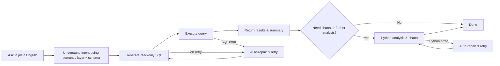

<div align="center">


### Open-Source AI Database Assistant

Ask questions in plain English, auto-generate read-only SQL, and get results, analysis, and charts.

[Features](#features) | [How It Works](#how-it-works) | [Quick Start](#quick-start) | [Tech Stack](#tech-stack)

</div>


## Features

<table>
<tr>
<td width="50%">

**Natural Language Queries**

Describe what you need in plain English — QueryGPT generates and executes read-only SQL, then returns structured results.

</td>
<td width="50%">

**Automatic Analysis Pipeline**

Query results automatically flow into Python analysis and chart generation, so a single question gets you a complete answer.

</td>
</tr>
<tr>
<td>

**Semantic Layer**

Define business terms (GMV, AOV, etc.) and QueryGPT references them automatically, eliminating ambiguity in your queries.

</td>
<td>

**Schema Relationship Graph**

Visually drag and connect tables to define JOIN relationships. QueryGPT picks the right join path automatically.

</td>
</tr>
</table>

## How It Works



## Screenshots


<p align="center"><strong>Schema Relationship Graph</strong></p>

<br>
<br>


<p align="center"><strong>Semantic Layer Configuration</strong></p>

## Quick Start

### 1. Clone the repo

```bash
git clone git@github.com:MKY508/QueryGPT.git
cd QueryGPT
```

### 2. Choose your platform

<table>
<tr>
<th width="33%">macOS</th>
<th width="33%">Linux</th>
<th width="33%">Windows</th>
</tr>
<tr>
<td>

**Option A — Run directly**

Requires Python 3.11+ and Node.js LTS

```bash
./start.sh
```

**Option B — Docker**

Requires [Docker Desktop](https://www.docker.com/products/docker-desktop/)

```bash
docker compose up --build
```

</td>
<td>

**Option A — Run directly**

Requires Python 3.11+ and Node.js LTS

```bash
./start.sh
```

**Option B — Docker**

Requires Docker Engine

```bash
docker compose up --build
```

</td>
<td>

**Recommended — Docker Desktop**

Windows users should use Docker. `.bat` / `.ps1` scripts are no longer maintained.

Install [Docker Desktop](https://www.docker.com/products/docker-desktop/), then:

```bash
docker compose up --build
```

**Alternative — WSL2**

After installing [WSL2](https://learn.microsoft.com/windows/wsl/install), run `./start.sh` from the WSL terminal as you would on Linux.

</td>
</tr>
</table>

### 3. Configure and start

After startup, open `http://localhost:3000`:

1. Go to Settings and add a model (provider + API key)
2. Use the built-in demo database, or connect your own SQLite / MySQL / PostgreSQL
3. Optionally set a default model, default connection, and conversation context rounds
4. Head to the chat page and start asking questions

> The project ships with a built-in SQLite demo database (`demo.db`). A sample connection is auto-created on first launch if no workspace data exists.

## Tech Stack

**Project**<br>


**Frontend**<br>


**Backend**<br>


**Databases**<br>


<details>
<summary><strong>Configuration Reference</strong></summary>

### Models

Supports OpenAI-compatible, Anthropic, Ollama, and Custom gateways. Configurable fields:

| Field | Description |
|-------|-------------|
| `provider` | Model provider |
| `base_url` | API endpoint |
| `model_id` | Model identifier |
| `api_key` | API key (optional for Ollama or unauthenticated gateways) |
| `extra headers` | Custom request headers |
| `query params` | Custom query parameters |
| `api_format` | API format |
| `healthcheck_mode` | Health check mode |

### Databases

Supports SQLite, MySQL, and PostgreSQL. The system only executes read-only SQL.

Built-in SQLite demo database:
- Path: `apps/api/data/demo.db`
- Default connection name: `Sample Database`

</details>

<details>
<summary><strong>Startup Scripts</strong></summary>

```bash
./start.sh              # Host mode: check env, install deps, init DB, start frontend + backend
./start.sh setup        # Host mode: install dependencies only
./start.sh stop         # Stop host mode services
./start.sh restart      # Restart host mode services
./start.sh status       # Check host mode status
./start.sh logs         # View host mode logs
./start.sh doctor       # Diagnose host mode environment
./start.sh test all     # Run all tests in host mode
./start.sh cleanup      # Clean up host mode temp state
```

Install analytics extras (`scikit-learn`, `scipy`, `seaborn`):

```bash
./start.sh install analytics
```

Optional environment variables:

```bash
QUERYGPT_BACKEND_RELOAD=1 ./start.sh     # Backend hot reload
QUERYGPT_BACKEND_HOST=0.0.0.0 ./start.sh # Listen on all interfaces
```

</details>

<details>
<summary><strong>Docker Development</strong></summary>

Windows developers should use Docker; `start.ps1` / `start.bat` are no longer maintained.

Default dev stack starts:
- `web`: Next.js dev server (HMR enabled)
- `api`: FastAPI dev server (`--reload`)
- `db`: PostgreSQL 16

```bash
docker-compose up --build               # Start all services in foreground
docker-compose up -d --build            # Start all services in background
docker-compose down                     # Stop and remove containers
docker-compose down -v --remove-orphans # Also remove data volumes
docker-compose ps                       # View status
docker-compose logs -f api web          # View frontend/backend logs
docker-compose restart api web          # Restart frontend/backend
docker-compose up db                    # Start database only
docker-compose run --rm api ./run-tests.sh
docker-compose run --rm web npm run type-check
docker-compose run --rm web npm test
```

Notes:
- Frontend at `http://localhost:3000` by default
- Backend at `http://localhost:8000` by default
- PostgreSQL exposed at `localhost:5432`
- Run `docker-compose up --build` after dependency changes
- If you have the Docker Compose plugin installed, swap `docker-compose` for `docker compose`

</details>

<details>
<summary><strong>Local Development (Host Mode)</strong></summary>

### Backend

```bash
cd apps/api
python -m venv .venv
source .venv/bin/activate
pip install -e ".[dev]"
uvicorn app.main:app --reload --host 127.0.0.1 --port 8000
```

### Frontend

```bash
cd apps/web
npm install
npm run dev
```

### Environment Variables

Backend `apps/api/.env`:

```env
DATABASE_URL=sqlite+aiosqlite:///./data/querygpt.db
ENCRYPTION_KEY=your-fernet-key
```

Frontend `apps/web/.env.local`:

```env
NEXT_PUBLIC_API_URL=http://localhost:8000
# Optional: only needed for Docker / containerized Next rewrite
# INTERNAL_API_URL=http://api:8000
```

### Tests

```bash
# Frontend
cd apps/web && npm run type-check && npm test && npm run build

# Backend
./apps/api/run-tests.sh
```

### GitHub CI Layers

GitHub Actions is split into two layers:

- **Fast layer**: Backend `ruff + mypy (chat/config main path) + pytest`, frontend `lint + type-check + vitest + build`
- **Integration layer**: Docker full-stack, Playwright smoke tests, `start.sh` host-mode smoke tests, SQLite / PostgreSQL / MySQL connection tests, model tests with mock gateway

Run locally:

```bash
# Docker full-stack
docker compose -f docker-compose.yml -f docker-compose.ci.yml up -d --build

# Backend integration tests (requires PostgreSQL / MySQL / mock gateway env vars)
cd apps/api && pytest tests/test_config_integration.py -v

# Backend main-path type checking
cd apps/api && mypy --config-file mypy.ini

# Frontend browser smoke tests (app must be running first)
cd apps/web && npm run test:e2e
```

</details>

<details>
<summary><strong>Deployment</strong></summary>

### Backend

The repo includes a [render.yaml](render.yaml) for direct Render Blueprint deployment.

### Frontend

Recommended deployment on Vercel:

- Root Directory: `apps/web`
- Environment Variable: `NEXT_PUBLIC_API_URL=<your-api-url>`

</details>

## Known Limitations

- Only read-only SQL is allowed; write operations are blocked
- Auto-repair covers SQL, Python, and chart config errors that are recoverable
- `/chat/stop` is designed for single-instance semantics
- Node.js LTS is recommended for development; if `next dev` behaves oddly, clear `apps/web/.next`

## License

MIT

---
> Built with ❤️
