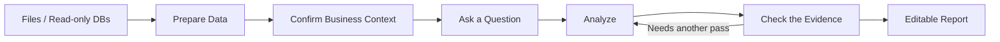

<div align="center">


Ask a question, check the evidence, and turn files or read-only databases into a report you can keep working on.

[English](README.md) | [中文](README.zh.md)

</div>

## Features

- **Start with a question** — ReceiptBI queries, joins, and analyzes the relevant data while keeping the supporting evidence close at hand
- **Prepare data without rewriting the source** — fix types, handle inconsistent values, and save the steps as a reusable recipe
- **Give every number a shared meaning** — keep confirmed metrics, dimensions, relationships, and business context with the data they describe
- **Build an editable report** — turn an investigation into metrics, tables, charts, and pages that keep their source references

## How It Works



## Product Tour

### Start with a business question

Each investigation keeps the original question, supporting data, findings, charts, and follow-up work in one place.


### Organize findings into an editable report

Choose an investigation, review the proposed outline, and create a draft without overwriting your existing edits.


### Preview and export a paginated report

The preview shows page breaks before printing or export, so metrics, charts, and references stay readable.


### Keep business definitions with the data they describe

Definitions stay with the source or table they describe. ReceiptBI only uses a metric or dimension inside its confirmed scope, so similarly named fields from unrelated tables are not quietly mixed together.


## Quick Start

### 1. Clone the repo

```bash
git clone https://github.com/MoonMao42/ReceiptBI.git
cd ReceiptBI
```

### 2. Run it

**macOS / Linux** — requires Python 3.11+ and Node.js LTS:

```bash
./start.sh
```

Or using Docker:

```bash
docker compose up --build
```

**Windows** — use [Docker Desktop](https://www.docker.com/products/docker-desktop/), or [WSL2](https://learn.microsoft.com/windows/wsl/install) + `./start.sh`. Desktop app is also available.

### 3. Configure

Open `http://localhost:3000`:

1. Choose a model provider in Settings (OpenAI-compatible, Anthropic, DeepSeek, or Ollama)
2. Add a file (CSV/XLSX/Parquet/JSON) or a read-only database connection (SQLite/MySQL/PostgreSQL)
3. Ask the first question you want the data to answer

## Tech Stack

- **Frontend**: Next.js 15, React 19, TypeScript
- **Backend**: FastAPI, Python 3.11+, PydanticAI
- **Desktop**: Electron, Rust (SQLite execution sidecar)
- **Data Engine**: DuckDB (for files), native adapters for DBs

<details>
<summary><strong>Configuration Reference</strong></summary>

### Models
Supports OpenAI-compatible, Anthropic, DeepSeek, Ollama, and custom gateways.

### Connections
- **Files**: CSV, XLS, XLSX, Parquet, JSON (processed via local DuckDB)
- **Databases**: SQLite, MySQL, PostgreSQL (read-only execution)

### Environment Variables
- `RECEIPTBI_BACKEND_HOST`: Set backend bind address (default: 127.0.0.1)
- `RECEIPTBI_BACKEND_RELOAD`: Enable backend hot-reload
- `RECEIPTBI_SQLITE_EXECUTOR_PATH`: Path to Rust SQLite sidecar (for desktop)

</details>

<details>
<summary><strong>Local Development</strong></summary>

### Workspace
Use the provided `start.sh` for standard web development:
```bash
./start.sh              # Start frontend and backend
./start.sh setup        # Install dependencies
./start.sh stop         # Stop services
./start.sh test         # Run tests
```

### Desktop
The desktop app uses Electron and bundles a Rust sidecar for read-only SQLite execution.
Check `apps/desktop/electron-builder.yml` for build configurations.

</details>

## Known Limitations

- Database connections are read-only; write statements are blocked
- Python execution fallback requires a local environment and is isolated per project
- Desktop builds are currently unsigned; the first launch on macOS may require manual approval

## License

MIT

## Previous Versions

| Version | Based on | Branch |
|---------|----------|--------|
| v2 | [gptme](https://github.com/gptme/gptme) | [v2](https://github.com/MoonMao42/ReceiptBI/tree/v2) |
| v1 | [Open Interpreter 0.4.3](https://github.com/OpenInterpreter/open-interpreter) | [v1](https://github.com/MoonMao42/ReceiptBI/tree/v1) |
