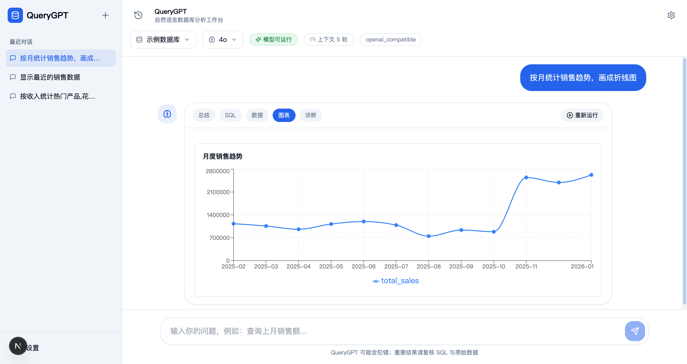
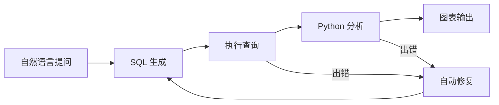
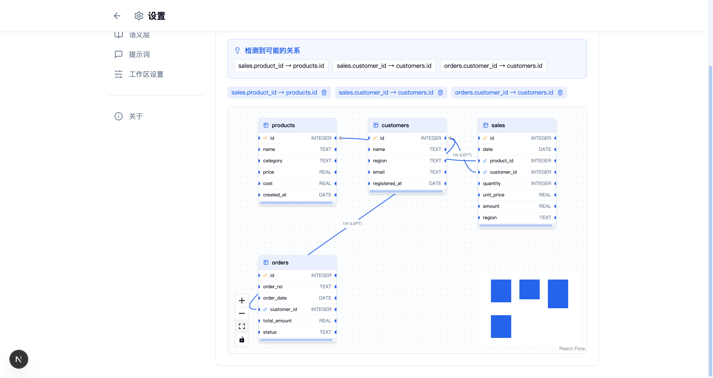
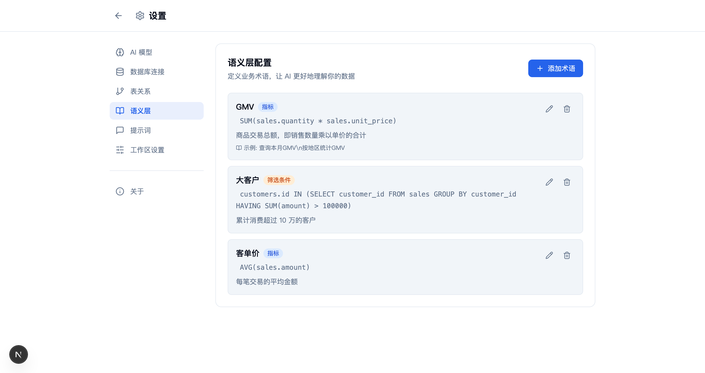

<div align="center">


### 用自然语言驱动数据库 — 提问、查询、分析、图表，一步到位。

开源 AI 数据库助手 | 中文优先 | 本地部署 | 只读安全

[](LICENSE)
[](https://www.python.org/)
[](https://fastapi.tiangolo.com/)
[](https://nextjs.org/)
[](https://github.com/mky508/querygpt/stargazers)
[](https://github.com/mky508/querygpt/commits/main)

</div>

---



---

## 核心能力

<table>
<tr>
<td width="50%">

**自然语言查询**

用中文描述需求，自动生成并执行只读 SQL，返回结构化结果。

</td>
<td width="50%">

**多模型适配**

支持 OpenAI-compatible、Anthropic、Ollama、Custom 网关，一套配置切换。

</td>
</tr>
<tr>
<td>

**自动分析链路**

查询结果自动衔接 Python 分析与图表生成，一次提问完成完整分析。

</td>
<td>

**诊断与自愈**

展示 provider、连接状态、执行轨迹；SQL 或 Python 执行出错时自动修复。

</td>
</tr>
<tr>
<td>

**语义层**

定义业务术语（GMV、客单价等），AI 查询时自动引用，消除歧义。

</td>
<td>

**Schema 关系视图**

可视化拖拽建立表间 JOIN 关系，AI 自动使用正确的关联路径。

</td>
</tr>
</table>

## 工作流程



## 界面一览

<table>
<tr>
<td width="50%" align="center">



**Schema 关系视图**

</td>
<td width="50%" align="center">



**语义层配置**

</td>
</tr>
</table>

## 快速开始


```bash
git clone git@github.com:mky508/querygpt.git
cd querygpt
./start.sh
```

启动后访问 `http://localhost:3000`，首次使用：

1. 在设置页添加模型（填入 provider 和 API Key）
2. 使用内置的 `示例数据库`，或添加自己的 SQLite / MySQL / PostgreSQL 连接
3. 按需设置默认模型、默认连接和上下文轮数
4. 回到聊天页开始提问

> 项目内置 SQLite 示例库 `demo.db`，空工作区启动时会自动补回示例连接。

## 技术栈

**前端**<br>


**后端**<br>


**数据库**<br>


<details>
<summary><strong>配置说明</strong></summary>

### 模型

支持 OpenAI-compatible、Anthropic、Ollama、Custom 网关。可配置项：

| 字段 | 说明 |
|------|------|
| `provider` | 模型提供方 |
| `base_url` | API 端点 |
| `model_id` | 模型标识 |
| `api_key` | 密钥（Ollama 或无需鉴权的网关可启用可选模式） |
| `extra headers` | 自定义请求头 |
| `query params` | 自定义查询参数 |
| `api_format` | API 格式 |
| `healthcheck_mode` | 健康检查方式 |

### 数据库

支持 SQLite、MySQL、PostgreSQL。系统只允许执行只读 SQL。

内置 SQLite 示例库：
- 路径：`apps/api/data/demo.db`
- 默认连接名：`示例数据库`

</details>

<details>
<summary><strong>启动脚本</strong></summary>

```bash
./start.sh          # 默认启动（检查环境、安装依赖、初始化数据库、启动前后端）
./start.sh setup    # 仅安装环境
./start.sh stop     # 停止服务
./start.sh restart  # 重启服务
./start.sh status   # 查看状态
./start.sh logs     # 查看日志
./start.sh doctor   # 环境诊断
./start.sh test all # 运行全部测试
./start.sh cleanup  # 清理临时文件
```

补装分析依赖（`scikit-learn`、`scipy`、`seaborn`）：

```bash
./start.sh install analytics
```

可选环境变量：

```bash
QUERYGPT_BACKEND_RELOAD=1 ./start.sh    # 后端热重载
QUERYGPT_BACKEND_HOST=0.0.0.0 ./start.sh # 监听所有网卡
```

</details>

<details>
<summary><strong>本地开发</strong></summary>

### 后端

```bash
cd apps/api
python -m venv .venv
source .venv/bin/activate
pip install -e ".[dev]"
uvicorn app.main:app --reload --host 127.0.0.1 --port 8000
```

### 前端

```bash
cd apps/web
npm install
npm run dev
```

### 环境变量

后端 `apps/api/.env`：

```env
DATABASE_URL=sqlite+aiosqlite:///./data/querygpt.db
ENCRYPTION_KEY=your-fernet-key
```

前端 `apps/web/.env.local`：

```env
NEXT_PUBLIC_API_URL=http://localhost:8000
```

### 测试

```bash
# 前端
cd apps/web && npm run type-check && npm test && npm run build

# 后端
./apps/api/run-tests.sh
```

</details>

<details>
<summary><strong>部署</strong></summary>

### 后端

仓库自带 [render.yaml](render.yaml)，可直接用于 Render Blueprint 部署。

### 前端

推荐部署到 Vercel：

- Root Directory: `apps/web`
- Environment Variable: `NEXT_PUBLIC_API_URL=<your-api-url>`

</details>

## 已知边界

- 只允许只读 SQL，不支持写操作
- 自动修复覆盖 SQL、Python、图表配置等可恢复错误
- `/chat/stop` 按单实例语义设计
- 开发环境建议使用 Node.js LTS；如 `next dev` 异常，先清理 `apps/web/.next`

## 许可证

MIT
