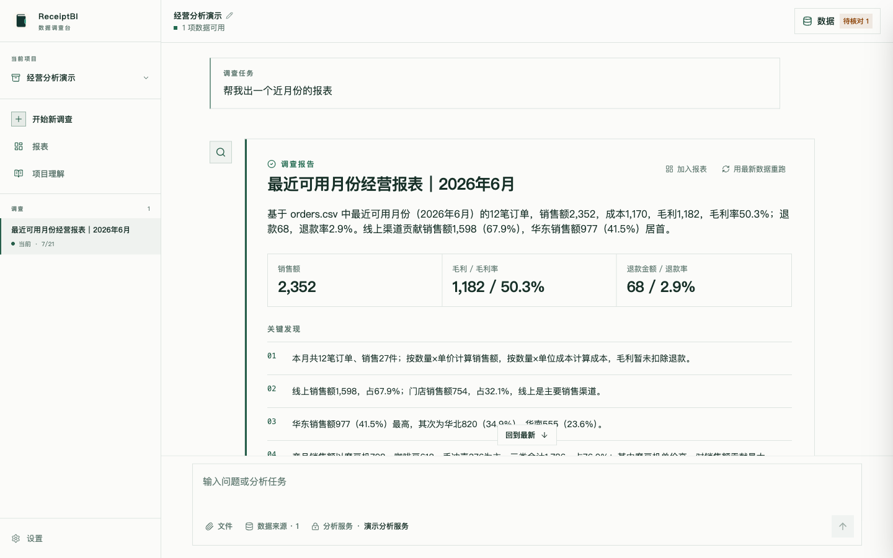
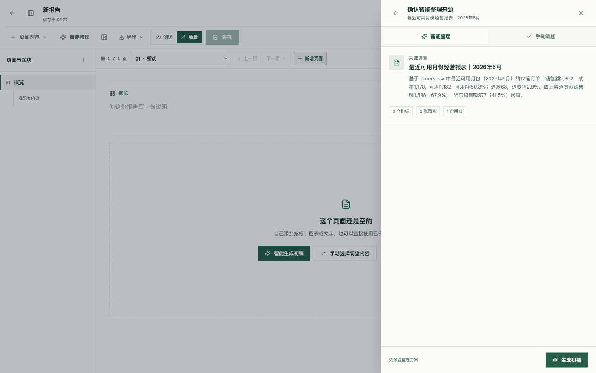
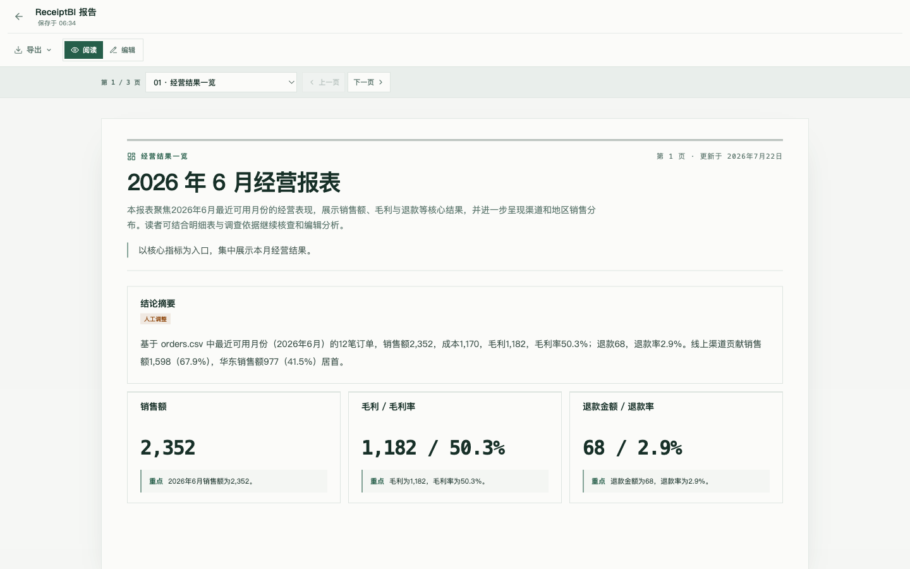
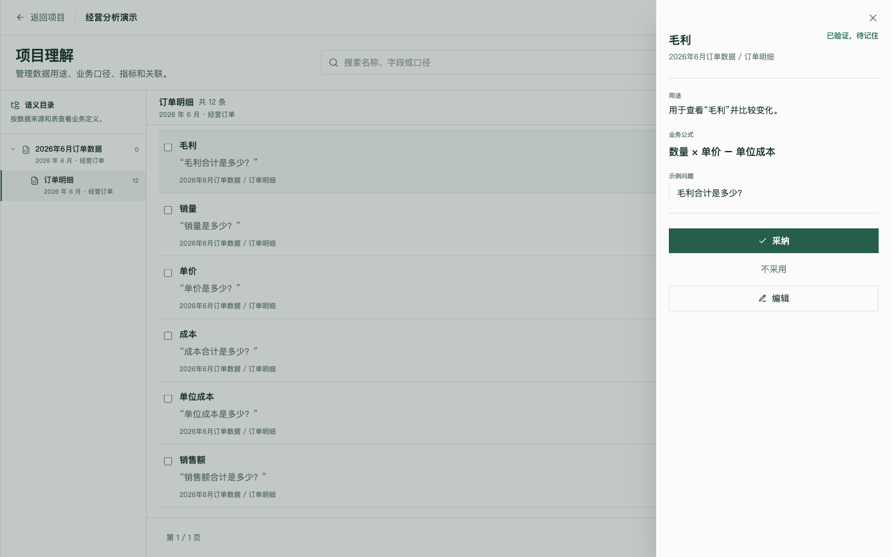

<div align="center">


ReceiptBI 用来调查文件和只读数据库。你可以回看结论依据，也可以把结果继续整理成报表。

[中文](README.md) | [English](README.en.md)

</div>

## 功能特点

- 用自然语言提出业务问题。ReceiptBI 会查询并关联相关数据，结论和依据放在同一次调查里。
- 清理字段类型和不规范值时不会改写源文件。处理步骤可以保存下来，供后续数据重复使用。
- 指标、维度、表关系和业务背景按数据来源与表保存，避免混用口径。
- 调查结果可以整理成包含指标、表格、图表和来源的可编辑报表。

## 下载桌面版

从 [Releases](https://github.com/MoonMao42/ReceiptBI/releases/latest) 下载最新版本。macOS 提供 Apple 芯片版和 Intel 版，Windows 提供 x64 安装程序。

## 工作原理


## 产品一览

### 从一个业务问题开始调查

每次调查都把最初的问题、相关数据、发现、图表和后续工作放在一起。



### 把调查结果整理成可编辑报表

选择一次调查，核对建议的结构，再生成草稿；已经手动编辑过的内容不会被直接覆盖。



### 预览并导出分页报表

页面预览会提前显示分页位置，让指标、图表和来源在打印或导出后仍然清楚。



### 让业务定义留在它真正适用的数据下面

每条定义都留在它描述的数据来源或表下面。只有进入已经确认的范围，ReceiptBI 才会采用对应的指标和维度，避免把无关表里的同名字段混在一起。



## 快速开始

### 1. 克隆项目

```bash
git clone https://github.com/MoonMao42/ReceiptBI.git
cd ReceiptBI
```

### 2. 运行项目

macOS / Linux 需要 Python 3.11+ 和 Node.js LTS：

```bash
./start.sh
```

也可以用 Docker 运行：

```bash
docker compose up --build
```

Windows 推荐使用 Docker Desktop，或在 WSL2 中运行 `./start.sh`。也可以直接使用桌面版。

### 3. 配置使用

打开 `http://localhost:3000`：

1. 在设置中选择模型服务（OpenAI 兼容接口、Anthropic、DeepSeek 或 Ollama）
2. 添加文件（CSV/XLSX/Parquet/JSON）或只读数据库连接（SQLite/MySQL/PostgreSQL）
3. 提出第一个希望数据回答的问题

## 技术栈

| 部分 | 技术 |
|------|------|
| 前端 | Next.js 15、React 19、TypeScript |
| 后端 | FastAPI、Python 3.11+、PydanticAI |
| 桌面端 | Electron、Rust（SQLite 执行 sidecar） |
| 数据引擎 | DuckDB（文件处理）、原生数据库适配器 |

<details>
<summary><strong>配置参考</strong></summary>

### 支持模型

ReceiptBI 支持 OpenAI 兼容格式、Anthropic、DeepSeek、Ollama 以及自定义网关。

### 数据连接

- CSV、XLS、XLSX、Parquet 和 JSON 文件通过本地 DuckDB 处理
- SQLite、MySQL 和 PostgreSQL 数据库仅支持只读查询

### 环境变量

- `RECEIPTBI_BACKEND_HOST`: 后端监听地址（默认：127.0.0.1）
- `RECEIPTBI_BACKEND_RELOAD`: 开启后端热更新
- `RECEIPTBI_SQLITE_EXECUTOR_PATH`: Rust SQLite sidecar 路径（桌面端使用）

</details>

<details>
<summary><strong>本地开发</strong></summary>

### 工作区管理

使用提供的 `start.sh` 进行标准 Web 开发：
```bash
./start.sh              # 启动前后端服务
./start.sh setup        # 安装依赖
./start.sh stop         # 停止服务
./start.sh test         # 运行测试
```

### 桌面端

桌面端基于 Electron 构建，并打包了一个 Rust sidecar 用于执行只读 SQLite 查询。
具体的打包配置请参考 `apps/desktop/electron-builder.yml`。

</details>

## 开源协议

MIT

## 历史版本

| 版本 | 基于 | 分支 |
|------|------|------|
| v2 | [gptme](https://github.com/gptme/gptme) | [v2](https://github.com/MoonMao42/ReceiptBI/tree/v2) |
| v1 | [Open Interpreter 0.4.3](https://github.com/OpenInterpreter/open-interpreter) | [v1](https://github.com/MoonMao42/ReceiptBI/tree/v1) |
