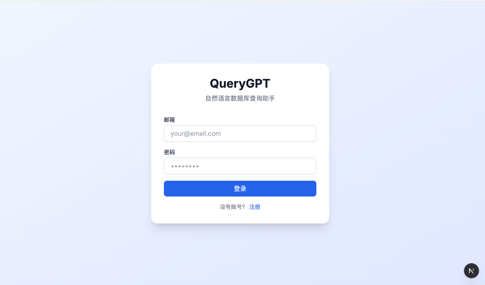

<div align="center">


用中文问数据库，自动完成 SQL、分析、图表和诊断。

[](LICENSE)
[](https://www.python.org/)
[](https://fastapi.tiangolo.com/)
[](https://nextjs.org/)

</div>

## 简介

QueryGPT 是一个面向中文场景的数据库分析助手。

它不只是把自然语言翻成 SQL，而是把一次提问完整跑下来:

- 生成 SQL
- 执行查询
- 输出图表或 Python 分析
- 返回总结
- 出错时给出诊断，并自动修复可恢复的问题

适合做内部数据助手、本地分析工具，或者接 OpenAI-compatible 网关的私有部署场景。

## 功能

- 自然语言查询: 用中文描述需求，自动生成并执行只读 SQL
- 多模型适配: 支持 OpenAI-compatible、Anthropic、Ollama、Custom 网关
- 自动分析链路: 查询结果可以继续生成图表或 Python 分析
- 诊断与自愈: 展示 provider、数据库连接、尝试记录，并自动修复常见执行错误
- 语义层与表关系: 支持业务术语、关系管理、Schema 布局
- 多用户隔离: JWT 认证、用户配置、聊天历史、默认模型和连接

## 界面截图

| 登录 | 对话工作台 |
| --- | --- |
|  |  |

| 语义层 | Schema 关系视图 |
| --- | --- |
|  |  |

## 快速开始

需要:

- Python 3.11+
- Node.js 18+

```bash
git clone git@github.com:mky508/querygpt.git
cd querygpt
./start.sh
```

启动后访问:

- 前端: `http://localhost:3000`
- 后端: `http://localhost:8000`
- API 文档: `http://localhost:8000/api/docs`

第一次进入后:

1. 注册或登录
2. 在设置页添加模型
3. 添加数据库连接
4. 选择默认模型和默认连接
5. 回到聊天页直接提问

## 配置说明

### 模型

支持:

- OpenAI-compatible
- Anthropic
- Ollama
- Custom 网关

可配置项包括:

- `provider`
- `base_url`
- `model_id`
- `api_key`
- `extra headers`
- `query params`
- `api_format`
- `healthcheck_mode`

如果使用本地 Ollama 或无需鉴权的网关，可以启用可选 API Key 模式。

### 数据库

支持:

- SQLite
- MySQL
- PostgreSQL

系统只允许执行只读 SQL。

## 启动脚本

默认启动:

```bash
./start.sh
```

常用命令:

```bash
./start.sh stop
./start.sh restart
./start.sh status
./start.sh logs
```

可选环境变量:

```bash
QUERYGPT_BACKEND_RELOAD=1 ./start.sh
QUERYGPT_BACKEND_HOST=0.0.0.0 ./start.sh
```

## 本地开发

### 后端

```bash
cd apps/api
python -m venv .venv
source .venv/bin/activate
pip install -e ".[dev]"
uvicorn app.main:app --reload --host 127.0.0.1 --port 8000
```

### 前端

```bash
cd apps/web
npm install
npm run dev
```

### 环境变量

后端 `apps/api/.env`:

```env
DATABASE_URL=sqlite+aiosqlite:///./data/querygpt.db
JWT_SECRET_KEY=your-secret-key
ENCRYPTION_KEY=your-fernet-key
```

前端 `apps/web/.env.local`:

```env
NEXT_PUBLIC_API_URL=http://localhost:8000
```

## 测试

前端:

```bash
cd apps/web
npm run type-check
npm test
npm run build
```

后端:

```bash
cd apps/api
python -m pytest
```

## 部署

### 后端

仓库里已经带了 [render.yaml](render.yaml)，可以直接用于 Render Blueprint 部署。

### 前端

推荐部署到 Vercel:

- Root Directory: `apps/web`
- Environment Variable: `NEXT_PUBLIC_API_URL=<your-api-url>`

## 技术栈

| 后端 | 前端 |
| --- | --- |
| FastAPI | Next.js 15 |
| SQLAlchemy 2.0 | React 19 |
| LiteLLM | TypeScript |
| SQLite / MySQL / PostgreSQL | TanStack Query + Zustand |

## 目前这版的特点

- 聊天页会显示模型 provider、数据库连接、上下文轮数、执行耗时和结果行数
- 可恢复错误会自动继续修复，例如 SQL 或 Python 执行错误
- 历史对话会保留执行上下文，支持按原配置重新运行

## 已知边界

- 只允许只读 SQL
- `/chat/stop` 目前按单实例语义设计
- 自动修复优先覆盖 SQL、Python、图表配置这类可恢复错误

## 许可证

MIT

