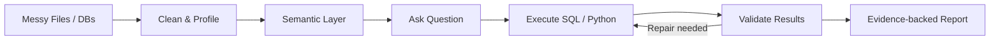
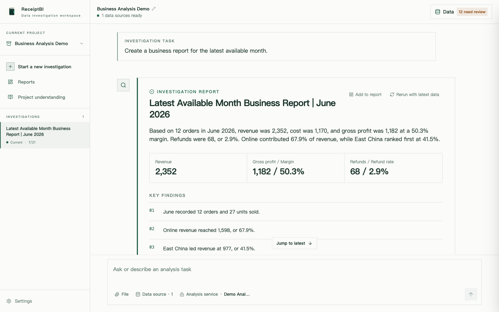
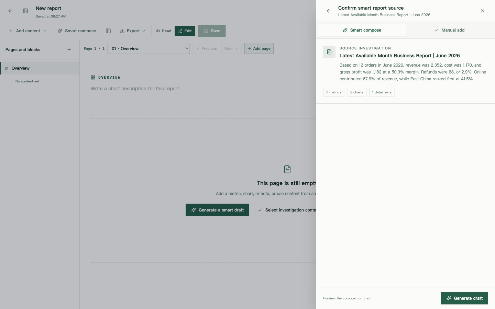
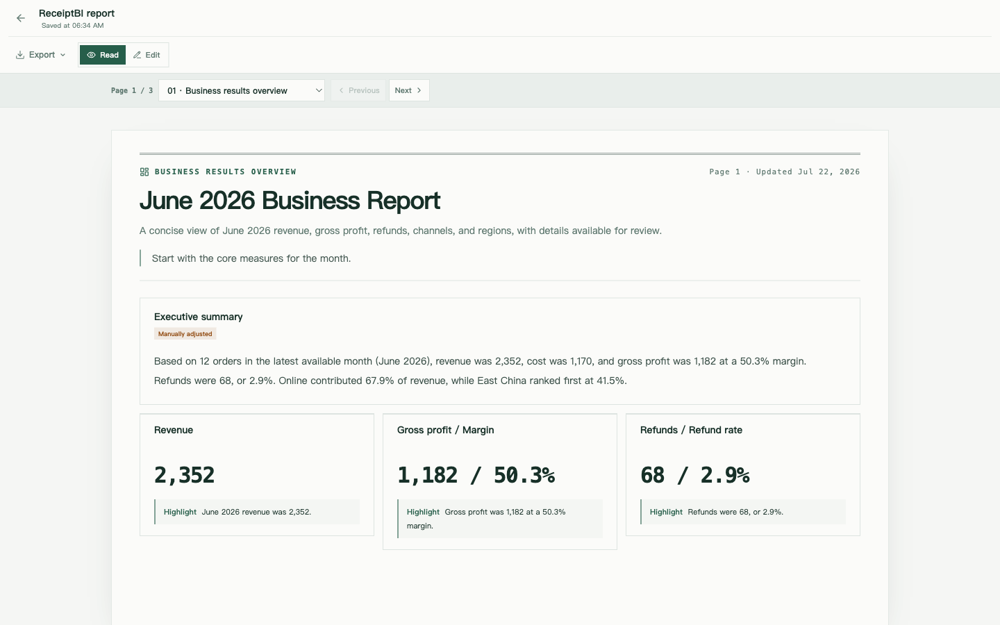
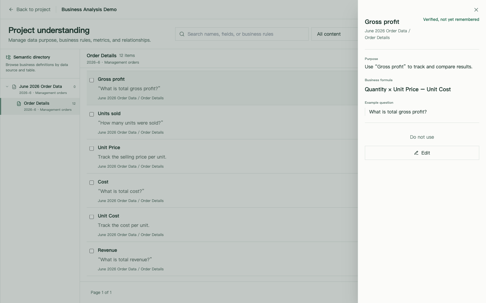

<div align="center">


Talk to your data. Local-first analysis for messy files and read-only databases.

[English](README.md) | [中文](README.zh.md)

</div>

## Features

- **Conversational analysis** — ask questions while ReceiptBI safely queries, joins, and analyzes your data
- **Data prep & cleaning** — visually clean files, fix types, and save non-destructive recipes
- **Governed business semantics** — organize confirmed context, metrics, dimensions, and relationships under the data where they apply
- **Editable reports** — turn chat results into durable, verifiable pages with metrics, tables, and charts

## How It Works



## Product Tour

### Investigate from a business question

ReceiptBI keeps the question, evidence, findings, charts, and follow-up work together in one investigation.



### Organize findings into an editable report

Choose an investigation, review the proposed structure, and generate a draft without overwriting the report you already edited.



### Preview and export a paginated report

Reports use a stable page layout so metrics, charts, and evidence remain readable when printed or exported.



### Keep definitions inside the data context they belong to

Business context is organized from project to source and table. Metrics and dimensions become available only within their confirmed scope, so similarly named fields from other tables are not silently mixed.



## Quick Start

### 1. Clone the repo

```bash
git clone https://github.com/MoonMao42/ReceiptBI.git
cd ReceiptBI
```

### 2. Run it

**macOS / Linux** — requires Python 3.11+ and Node.js LTS:

```bash
./start.sh
```

Or using Docker:

```bash
docker compose up --build
```

**Windows** — use [Docker Desktop](https://www.docker.com/products/docker-desktop/), or [WSL2](https://learn.microsoft.com/windows/wsl/install) + `./start.sh`. Desktop app is also available.

### 3. Configure

Open `http://localhost:3000`:

1. Go to Settings and configure your preferred model provider (OpenAI-compatible, Anthropic, DeepSeek, Ollama)
2. Upload a file (CSV/XLSX/Parquet/JSON) or connect a database (SQLite/MySQL/PostgreSQL)
3. Start investigating your data

## Tech Stack

- **Frontend**: Next.js 15, React 19, TypeScript
- **Backend**: FastAPI, Python 3.11+, PydanticAI
- **Desktop**: Electron, Rust (SQLite execution sidecar)
- **Data Engine**: DuckDB (for files), native adapters for DBs

<details>
<summary><strong>Configuration Reference</strong></summary>

### Models
Supports OpenAI-compatible, Anthropic, DeepSeek, Ollama, and custom gateways.

### Connections
- **Files**: CSV, XLS, XLSX, Parquet, JSON (processed via local DuckDB)
- **Databases**: SQLite, MySQL, PostgreSQL (read-only execution)

### Environment Variables
- `RECEIPTBI_BACKEND_HOST`: Set backend bind address (default: 127.0.0.1)
- `RECEIPTBI_BACKEND_RELOAD`: Enable backend hot-reload
- `RECEIPTBI_SQLITE_EXECUTOR_PATH`: Path to Rust SQLite sidecar (for desktop)

</details>

<details>
<summary><strong>Local Development</strong></summary>

### Workspace
Use the provided `start.sh` for standard web development:
```bash
./start.sh              # Start frontend and backend
./start.sh setup        # Install dependencies
./start.sh stop         # Stop services
./start.sh test         # Run tests
```

### Desktop
The desktop app uses Electron and bundles a Rust sidecar for safe SQLite execution.
Check `apps/desktop/electron-builder.yml` for build configurations.

</details>

## Known Limitations

- System enforces read-only operations for databases; write statements are blocked
- Python execution fallback requires a local environment and is isolated per project
- Desktop packaging (macOS signing/Windows installer) is still in developer preview

## License

MIT

## Previous Versions

| Version | Based on | Branch |
|---------|----------|--------|
| v2 | [gptme](https://github.com/ErikBjare/gptme) | [v2](https://github.com/MoonMao42/ReceiptBI/tree/v2) |
| v1 | Original architecture | [v1](https://github.com/MoonMao42/ReceiptBI/tree/v1) |
