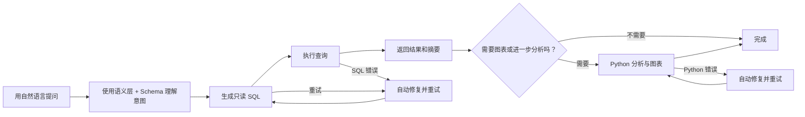

<div align="center">


Text-to-SQL 工具——用自然语言提问，生成只读 SQL，拿到结果、分析和图表。

[English](README.md) | [中文](README.zh.md)

</div>


## 功能

- **自然语言查询** — 描述你的需求，拿到 SQL + 结果
- **自动分析** — 查询结果自动流入 Python 做进一步分析和出图
- **语义层** — 定义业务术语（GMV、AOV 等），生成的 SQL 不会有歧义
- **Schema 关系图** — 拖拽连接表定义 JOIN 关系，自动选择连接路径

## 工作原理



## 截图


## 快速开始

### 1. 克隆仓库

```bash
git clone https://github.com/MoonMao42/ReceiptBI.git
cd ReceiptBI
```

### 2. 运行

**macOS / Linux** — 需要 Python 3.11+ 和 Node.js LTS：

```bash
./start.sh
```

或者用 Docker：

```bash
docker compose up --build
```

**Windows** — 用 [Docker Desktop](https://www.docker.com/products/docker-desktop/)，或者 [WSL2](https://learn.microsoft.com/windows/wsl/install) + `./start.sh`。

### 3. 配置

打开 `http://localhost:3000`：

1. 进设置页面，添加模型（提供商 + API 密钥）
2. 用内置的演示数据库，或者连你自己的 SQLite / MySQL / PostgreSQL
3. 可选：设置默认模型、默认连接和对话上下文轮数
4. 开始提问

> 自带 SQLite 演示数据库（`demo.db`），首次启动会自动创建示例连接。

## 技术栈

- **前端**：Next.js 15, React 19, TypeScript, Zustand, TanStack Query
- **后端**：FastAPI, SQLAlchemy 2.0, LiteLLM, Python 3.11+
- **数据库**：SQLite, MySQL, PostgreSQL

<details>
<summary><strong>配置参考</strong></summary>

### 模型

支持 OpenAI 兼容、Anthropic、Ollama 和自定义网关。可配置字段：

| 字段 | 说明 |
|------|------|
| `provider` | 模型提供商 |
| `base_url` | API 端点 |
| `model_id` | 模型标识符 |
| `api_key` | API 密钥（Ollama 或未认证网关可选） |
| `extra headers` | 自定义请求头 |
| `query params` | 自定义查询参数 |
| `api_format` | API 格式 |
| `healthcheck_mode` | 健康检查模式 |

### 数据库

支持 SQLite、MySQL 和 PostgreSQL。系统只执行只读 SQL。

内置 SQLite 演示数据库：
- 路径：`apps/api/data/demo.db`
- 默认连接名称：`Sample Database`

</details>

<details>
<summary><strong>启动脚本</strong></summary>

```bash
./start.sh              # 主机模式：检查环境、安装依赖、初始化数据库、启动前后端
./start.sh setup        # 主机模式：仅安装依赖
./start.sh stop         # 停止主机模式服务
./start.sh restart      # 重启主机模式服务
./start.sh status       # 检查主机模式状态
./start.sh logs         # 查看主机模式日志
./start.sh doctor       # 诊断主机模式环境
./start.sh test all     # 在主机模式下运行所有测试
./start.sh cleanup      # 清理主机模式临时状态
```

安装分析扩展（`scikit-learn`, `scipy`, `seaborn`）：

```bash
./start.sh install analytics
```

可选环境变量：

```bash
QUERYGPT_BACKEND_RELOAD=1 ./start.sh     # 后端热重载
QUERYGPT_BACKEND_HOST=0.0.0.0 ./start.sh # 监听所有接口
```

</details>

<details>
<summary><strong>Docker 开发</strong></summary>

Windows 开发者用 Docker；`start.ps1` / `start.bat` 不再维护。

默认开发栈：
- `web`: Next.js 开发服务器（HMR）
- `api`: FastAPI 开发服务器（`--reload`）
- `db`: PostgreSQL 16

```bash
docker-compose up --build               # 在前台启动所有服务
docker-compose up -d --build            # 在后台启动所有服务
docker-compose down                     # 停止并删除容器
docker-compose down -v --remove-orphans # 同时删除数据卷
docker-compose ps                       # 查看状态
docker-compose logs -f api web          # 查看前后端日志
docker-compose restart api web          # 重启前后端
docker-compose up db                    # 仅启动数据库
docker-compose run --rm api ./run-tests.sh
docker-compose run --rm web npm run type-check
docker-compose run --rm web npm test
```

注意：
- 前端：`http://localhost:3000`
- 后端：`http://localhost:8000`
- PostgreSQL：`localhost:5432`
- 改了依赖后跑 `docker-compose up --build`
- 装了 Docker Compose 插件的话用 `docker compose` 替换 `docker-compose`

</details>

<details>
<summary><strong>本地开发（主机模式）</strong></summary>

### 后端

```bash
cd apps/api
python -m venv .venv
source .venv/bin/activate
pip install -e ".[dev]"
uvicorn app.main:app --reload --host 127.0.0.1 --port 8000
```

### 前端

```bash
cd apps/web
npm install
npm run dev
```

### 环境变量

后端 `apps/api/.env`：

```env
DATABASE_URL=sqlite+aiosqlite:///./data/querygpt.db
ENCRYPTION_KEY=your-fernet-key
```

前端 `apps/web/.env.local`：

```env
NEXT_PUBLIC_API_URL=http://localhost:8000
# 可选：仅在 Docker / 容器化 Next 重写时需要
# INTERNAL_API_URL=http://api:8000
```

### 测试

```bash
# 前端
cd apps/web && npm run type-check && npm test && npm run build

# 后端
./apps/api/run-tests.sh
```

### GitHub CI 分层

GitHub Actions 分两层：

- **快速层**：后端 `ruff + mypy (chat/config 主路径) + pytest`，前端 `lint + type-check + vitest + build`
- **集成层**：Docker 全栈、Playwright 冒烟测试、`start.sh` 主机模式冒烟测试、SQLite / PostgreSQL / MySQL 连接测试、模拟网关模型测试

本地运行：

```bash
# Docker 全栈
docker compose -f docker-compose.yml -f docker-compose.ci.yml up -d --build

# 后端集成测试（需要 PostgreSQL / MySQL / 模拟网关环境变量）
cd apps/api && pytest tests/test_config_integration.py -v

# 后端主路径类型检查
cd apps/api && mypy --config-file mypy.ini

# 前端浏览器冒烟测试（应用必须先运行）
cd apps/web && npm run test:e2e
```

</details>

<details>
<summary><strong>部署</strong></summary>

### 后端

仓库有 [render.yaml](render.yaml) 可以直接 Render Blueprint 部署。

### 前端

推荐 Vercel：

- 根目录：`apps/web`
- 环境变量：`NEXT_PUBLIC_API_URL=<your-api-url>`

</details>

## 已知局限

- 只允许只读 SQL，写操作会被拦
- 自动修复覆盖 SQL、Python 和图表配置错误（可恢复的）
- `/chat/stop` 按单实例语义工作
- 开发用 Node.js LTS；`next dev` 有问题的话清 `apps/web/.next`

## License

MIT
