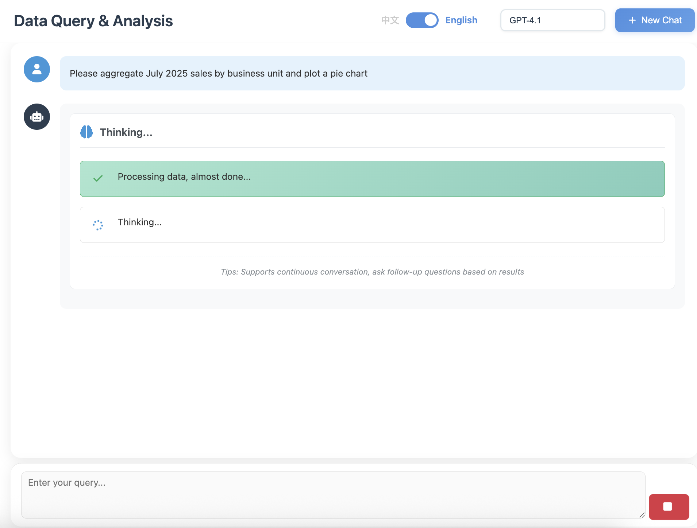
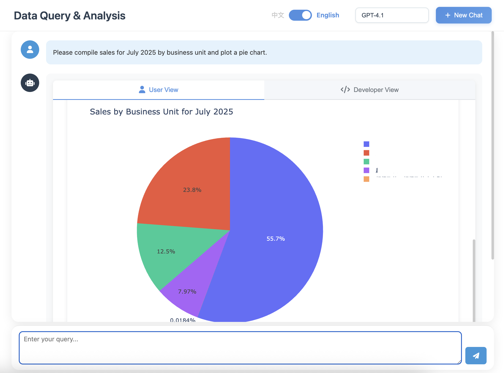
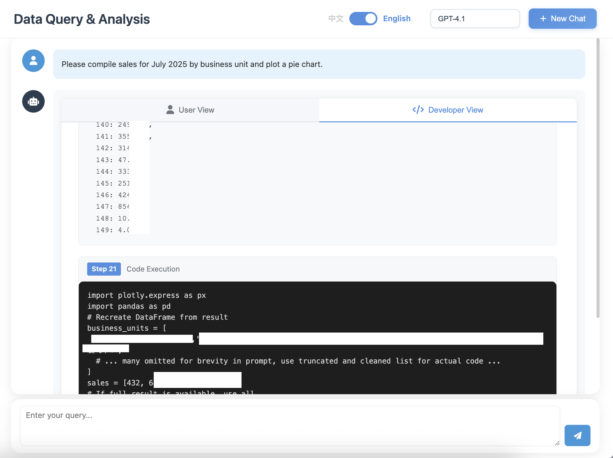

<div align="center">
  
  
  
  <br/>
  
  <p>
    <a href="README.md">English</a> •
    <a href="docs/README_CN.md">简体中文</a> •
    <a href="#">한국어</a>
  </p>
  
  <br/>
  
  [](LICENSE)
  [](https://www.python.org/)
  [](https://github.com/OpenInterpreter/open-interpreter)
  [](https://github.com/MoonMao42/ReceiptBI/stargazers)
  
  <br/>
  
  <h3>OpenInterpreter 기반 지능형 데이터 분석 에이전트</h3>
  <p><i>자연어로 데이터베이스와 대화하세요</i></p>
  
</div>

## ✨ 핵심 장점

**데이터 분석가처럼 생각합니다**
- **자율 탐색**: 문제 발생 시 테이블 구조와 샘플 데이터를 능동적으로 확인
- **다중 검증**: 이상 징후 발견 시 재검토하여 정확한 결과 보장
- **복잡한 분석**: SQL뿐만 아니라 통계 분석과 머신러닝을 위한 Python 실행 가능
- **가시적 사고**: 에이전트의 추론 과정을 실시간으로 표시 (Chain-of-Thought)

## 📸 시스템 스크린샷



**AI 사고 과정을 실시간으로 시각화, 한국어 대화만으로 복잡한 데이터 분석을 수행합니다.**

---



**인터랙티브 차트를 자동 생성, 데이터 인사이트를 한눈에 파악.**

---



**완전 투명한 코드 실행, SQL과 Python 듀얼 엔진 지원.**

## 🌟 기능

### 에이전트 핵심 기능
- **자율 데이터 탐색**: 데이터 구조를 능동적으로 파악하고 관계를 탐색
- **다단계 추론**: 문제 발생 시 심층 조사
- **Chain-of-Thought**: 실시간 사고 과정 노출, 언제든 개입 가능
- **컨텍스트 메모리**: 대화 이력을 이해하여 연속 분석 지원

### 데이터 분석 기능
- **SQL + Python**: SQL에 국한되지 않고 복잡한 Python 데이터 처리 지원
- **통계 분석**: 상관관계, 추세 예측, 이상 탐지 자동 수행
- **비즈니스 용어 이해**: YoY, MoM, 리텐션, 재구매 등 개념의 네이티브 이해
- **스마트 시각화**: 데이터 특성에 따라 최적 차트 자동 선택

### 시스템 특성
- **다중 모델 지원**: GPT-5, Claude, Gemini, Ollama 로컬 모델 자유 전환
- **유연한 배포**: 클라우드 API 또는 로컬 배포, 데이터 외부 유출 없음
- **히스토리 저장**: 분석 과정을 저장, 추적/공유 지원
- **데이터 보안**: 읽기 전용, SQL 인젝션 방지, 민감 데이터 마스킹
- **유연한 내보내기**: Excel, PDF, HTML 등 다양한 형식 지원

## 📦 기술 요구사항

- Python 3.10.x (필수, OpenInterpreter 0.4.3 의존성)
- MySQL 또는 호환 데이터베이스

> Windows: 반드시 WSL에서 실행 (PowerShell/CMD 직접 실행 금지)

## 📊 제품 비교

| 비교 항목 | **QueryGPT** | Vanna AI | DB-GPT | TableGPT | Text2SQL.AI |
|----------|:------------:|:--------:|:------:|:--------:|:-----------:|
| **비용** | **✅ 무료** | ⭕ 유료 | ✅ 무료 | ❌ 유료 | ❌ 유료 |
| **오픈소스** | **✅** | ✅ | ✅ | ❌ | ❌ |
| **로컬 배포** | **✅** | ✅ | ✅ | ❌ | ❌ |
| **Python 코드 실행** | **✅ 완전한 환경** | ❌ | ❌ | ❌ | ❌ |
| **시각화** | **✅ 프로그래밍 가능** | ⭕ 프리셋 | ✅ 풍부 | ✅ 풍부 | ⭕ 기본 |
| **비즈니스 용어 이해** | **✅ 네이티브** | ⭕ 기본 | ✅ 양호 | ✅ 우수 | ⭕ 기본 |
| **에이전트 자율 탐색** | **✅** | ❌ | ⭕ 기본 | ⭕ 기본 | ❌ |
| **실시간 사고 표시** | **✅** | ❌ | ❌ | ❌ | ❌ |
| **확장성** | **✅ 무제한** | ❌ | ❌ | ❌ | ❌ |

### 우리의 핵심 차별점
- **완전한 Python 환경**: 사전 기능이 아닌 실제 실행 환경, 어떤 코드도 작성 가능
- **무한 확장성**: 신규 기능이 필요하면 라이브러리 설치만으로 해결
- **자율 탐색 에이전트**: 문제 시 능동 조사, 일회성 쿼리에 그치지 않음
- **투명한 사고 과정**: 실시간으로 AI의 사고 과정을 확인/개입 가능
- **진정한 무료 오픈소스**: MIT 라이선스, 페이월 없음

## 🚀 빠른 시작

### 최초 사용

```bash
# 1) 프로젝트 클론
git clone https://github.com/MoonMao42/ReceiptBI.git
cd QueryGPT

# 2) 설치 스크립트 실행 (자동 환경 구성)
./setup.sh

# 3) 서비스 시작
./start.sh
```

### 이후 사용

```bash
# 빠른 시작 (환경 설치 완료 시)
./start.sh
```

서비스 기본 주소: http://localhost:5000

> **참고**: 5000 포트 점유 시 5001-5010 범위에서 가용 포트를 자동 선택하여 출력합니다.

## ⚙️ 구성 안내

### 기본 구성

1. **환경 파일 복사**
   ```bash
   cp .env.example .env
   ```
2. **.env 편집 후 설정**
   - `OPENAI_API_KEY`: OpenAI API 키
   - `OPENAI_BASE_URL`: API 엔드포인트 (선택)
   - DB 연결 정보

### 시맨틱 레이어 (선택)

비즈니스 용어 이해를 강화하는 선택 기능입니다. **미구성 시에도 기본 기능 정상 동작.**

1. 샘플 복사
   ```bash
   cp backend/semantic_layer.json.example backend/semantic_layer.json
   ```
2. 비즈니스에 맞게 수정
   - **DB 매핑**, **핵심 비즈니스 테이블**, **빠른 검색 인덱스** 등을 포함

## 📁 프로젝트 구조

```
QueryGPT/
├── backend/
│   ├── app.py
│   ├── database.py
│   ├── interpreter_manager.py
│   ├── history_manager.py
│   └── config_loader.py
├── frontend/
│   ├── templates/
│   └── static/
│       ├── css/
│       └── js/
├── docs/
├── logs/
├── output/
├── requirements.txt
└── .env.example
```

## 🔌 API

### 쿼리 인터페이스

```http
POST /api/chat
Content-Type: application/json

{
  "message": "이번 달 총 매출 조회",
  "model": "default"
}
```

### 히스토리

```http
GET /api/history/conversations
GET /api/history/conversation/:id
DELETE /api/history/conversation/:id
```

### 헬스체크

```http
GET /api/health
```

## 🔒 보안 안내

- 읽기 전용 쿼리만 지원 (SELECT, SHOW, DESCRIBE)
- 위험한 SQL 자동 필터링
- DB 사용자는 읽기 전용 권한으로 구성

## 📄 라이선스

MIT License - 자세한 내용은 [LICENSE](LICENSE) 참고

## 🆕 최신 업데이트

- 2025-09-05 – 시작 속도 최적화: 첫 모델 페이지 진입 시 자동 배치 테스트 제거로 불필요한 요청 감소 및 상태 오기록 방지

## 👨‍💻 작성자

- **작성자**: MoonMao42
- **GitHub**: [@MoonMao42](https://github.com/MoonMao42)
- **생성일**: 2025년 8월

## ⭐ Star History

<div align="center">
  <a href="https://star-history.com/#MoonMao42/ReceiptBI&Date">
    <picture>
      <source media="(prefers-color-scheme: dark)" srcset="https://api.star-history.com/svg?repos=MoonMao42/ReceiptBI&type=Date&theme=dark" />
      <source media="(prefers-color-scheme: light)" srcset="https://api.star-history.com/svg?repos=MoonMao42/ReceiptBI&type=Date" />
      
    </picture>
  </a>
</div>

## 🤝 기여

Issues 및 Pull Request 환영합니다.

1. 저장소 Fork
2. 기능 브랜치 생성 (`git checkout -b feature/AmazingFeature`)
3. 변경 커밋 (`git commit -m 'Add some AmazingFeature'`)
4. 브랜치 푸시 (`git push origin feature/AmazingFeature`)
5. Pull Request 생성
