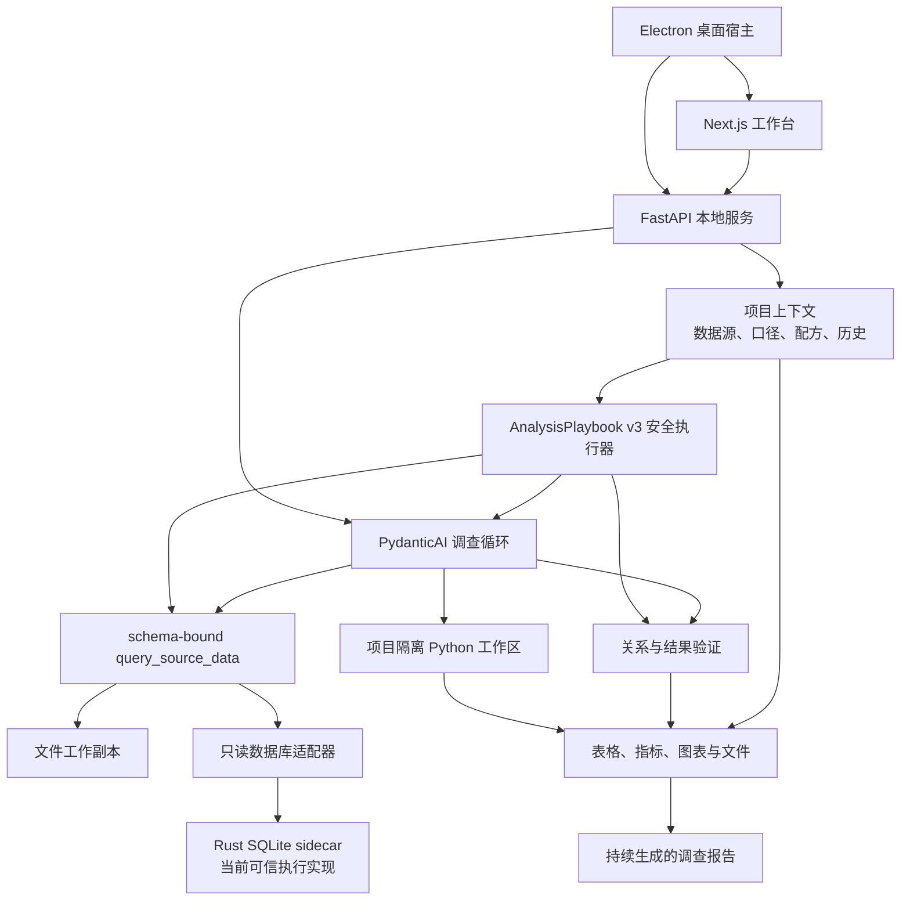

# ReceiptBI 架构

> 本文描述当前维护的 `apps/` 运行时与 `crates/` Rust 执行底座。能力完成度以 [`../STATUS.md`](../STATUS.md) 为准。

## 核心分工

ReceiptBI 不是“模型先写一段 SQL，再固定执行一段 Python”的流水线。它把职责拆成三个边界明确、可分别增强的层：

- **Rust：可信数据执行底座。** 系统负责只读、资源限制、取消、来源身份和结果边界，不把这些要求交给模型记忆。当前已落地的第一块是桌面打包链中的 SQLite sidecar；文件、MySQL 和 PostgreSQL 仍经过 Python 服务内的受控适配器，尚未全部迁入 Rust。
- **Python：开放分析环境。** FastAPI、数据预检、结构化查询编译和项目隔离 Python 工作区负责清洗、统计、转换以及长尾图表。Python 是分析能力层，不是可信边界的唯一所有者。
- **系统执行器：窄而确定的复用通道。** AnalysisPlaybook v3 只有在单一逻辑来源、单个类型化查询和一次最终校验的严格形态下，才会在模型之前由系统重新绑定当前来源、重新编译并执行；复杂方法继续交给 Agent 重新规划。
- **Agent：调查编排与解释。** PydanticAI Agent 根据问题和中间发现，自主选择结构化查询、原始只读查询、Python、关系验证和结果验证，可以多轮改变方向；对于系统已执行并校验的 v3 结果，Agent 只解释和呈现这份当前结果，不再重新读取来源替换它。

这套分工允许模型能力有差异：模型影响调查深度和方向，系统仍掌握数据读取、字段绑定、只读执行、关系启用、证据记录与完成条件。

## 当前组件

### 桌面与前端

- `apps/desktop/electron/` 管理本地 FastAPI 与 Next.js 进程、启动失败界面、IPC 和生命周期。
- `apps/web/src/app/` 提供工作台、设置和关于页面。
- `apps/web/src/components/chat/` 组合项目、数据来源、项目理解与整理记录、横向报告历史、纠正和继续追问。
- 文件来源可以在普通工作台打开可视化整理面板：用户从受控步骤中组合操作，先查看有界的前后样本和变化数量，再明确应用；已有的人工步骤也可以修改或清空。
- 结构化图表使用版本化的 [`CHART_SPEC.md`](CHART_SPEC.md) 合同。Agent 只推荐图型和字段绑定，系统绑定已验证结果，前端用固定 React 组件渲染；报告工作台允许在同一合同内手动调整，而不接受模型生成的 JavaScript 或任意渲染器配置。
- 普通界面只展示业务状态与依据；SQL、Python、诊断和底层定义留在高级入口。

### 应用与 Agent 层

- `apps/api/app/api/v1/projects.py` 提供项目、来源、预检、语义知识、纠正、分析运行和产物接口。
- `apps/api/app/services/execution.py` 组装模型、项目上下文和分析运行时。
- `apps/api/app/services/analyst_runtime.py` 实现 PydanticAI 调查循环及 `query_source_data`、Python、关系验证和 `validate_result` 等工具。
- `apps/api/app/services/analysis_playbook_runner.py` 执行 AnalysisPlaybook v3 的窄安全通道：只接受单来源、单类型化查询和最终校验，绑定当前数据后生成不含 SQL 的执行回执；回执把方法形状、当前来源、结果、画像和校验相互绑定。
- `apps/api/app/services/structured_query.py` 承担该通道复用的结构化查询校验、只读编译与当前来源执行；分析就绪的文件通过 DuckDB 查询，数据库走对应只读适配器。保存的方法只携带声明式查询意图，不保存物理来源 ID 或编译后的 SQL。
- `apps/api/app/services/project_context.py` 只加载当前项目的数据源、候选/已确认/锁定知识与可执行关系，避免跨项目串用。
- `apps/api/app/services/semantic_revisions.py` 把每次语义修改、恢复和来源记录为不可变版本；恢复会生成新版本，旧写入者不能覆盖更新后的 active head。
- `apps/api/app/services/business_decision_slots.py` 为少量已注册的关键业务问题提供系统拥有的稳定身份；只接受显式别名或同时满足多组业务信号的保守映射，旧别名冲突时拒绝自动复用。
- `apps/api/app/services/validated_result_evidence.py` 与 `metric_candidate_learning.py` 从完整保留的最终结果中提取系统可证明的窄语义候选。当前只接受单一结构化查询产生的无筛选、无维度、单指标 `sum/avg`；候选业务含义仍待确认，但其来源绑定、结果哈希和执行验证独立保存，模型 proposal 不能原地改写。
- `apps/api/app/services/sanitation_contract.py` 只接受版本化、有限且可验证的声明式整理操作；未知操作、未来版本或夹带 SQL/Python 的步骤会在读取文件前失败。
- 可视化整理的 preview 在临时目录重跑方法并用 DuckDB 做有界的行列、样本和单元格变化比较，不把整张前后表加载进 Python；apply 会重新执行并核对来源、工作副本、方法 head 和预览证明后才切换当前副本。
- `apps/api/app/services/sanitation_revisions.py` 为整理方法维护不可变修订链和 active head；恢复旧方法会追加修订，但必须重新应用后才会影响当前分析。
- `apps/api/app/api/v1/projects.py` 把 ProjectBundle 中的整理历史保留为无来源、只读的模板；模板先在可丢弃目录试运行，确认时重新核对原文件、当前工作副本、当前 recipe head、模板 head 和输出证明，全部一致后才在来源唯一的 recipe 上追加修订。
- `apps/api/app/services/metric_formula.py` 解释受限的声明式算术表达式，以 Decimal 逐行计算和汇总，不接受 `eval`、Python 片段或模型生成函数。

### 数据执行与分析层

- `apps/api/app/services/data_preflight.py` 对文件执行确定性预检和可重复清洗，保留原件并生成工作副本。
- `apps/api/app/services/analyst_runtime.py` 为分析就绪的文件建立受限 DuckDB 视图，聚合、筛选和 Join 在本地执行，模型和前端只接收有界结果；这不等于当前所有 CSV/XLSX 预检都已经改成流式 DuckDB 导入。
- `apps/api/app/services/database_value_preflight.py` 在严格表、列、行、字节和时间预算内对数据库做只读抽样画像；它优先使用真实主键/唯一约束提出粒度候选，并把声明外键保留为仍需值验证的关系依据，同时抑制敏感、标识符和高基数原值。
- `apps/api/app/services/database.py` 与 `database_adapters.py` 统一数据库只读访问，并在 SQLite、MySQL、PostgreSQL 可用时读取表类型、字段可空性、主键、外键与唯一约束；获取不到的约束会明确标记为不可用。当前 MySQL、PostgreSQL 和源码模式 SQLite 仍由 Python 适配器执行；取消事件会中断活动查询，PostgreSQL 使用驱动取消，MySQL 使用独立控制连接终止当前查询并在失败时关闭目标连接。
- `crates/sqlite-executor-core/` 与 `crates/sqlite-executor-sidecar/` 提供当前 Rust 可信执行实现；桌面打包时由 `apps/desktop/scripts/build-pyinstaller.ts` 构建并与冻结后端一起分发。
- `apps/api/app/services/python_sandbox.py` 和项目工作区承接开放式计算、统计与图表。自由 Python 产生的进程内状态目前不可安全重放，因此执行过自由 Python 后的检查点会标记为不可恢复。

## 一次调查如何运行

1. 用户在当前项目提出目标；系统加载该项目的数据源、文件预检或数据库约束目录与只读值画像、已确认口径、可执行关系、已提升为项目知识的纠正和可复用分析方法。数据库画像明确标注抽样和预算，声明外键也不能绕过值验证或冒充已验证关系。
2. 若这是绑定 AnalysisPlaybook v3 的持续分析，系统先检查其执行模式。只有“单一逻辑来源 + 单个类型化查询 + 最终校验”的方法会在模型之前绑定当前来源、核对 schema、重新编译执行并生成 SQL-free receipt；复杂、未知或 v2 方法仍标记为 `agent_replan_required`，不会复用旧结果。
3. 没有安全系统执行结果时，Agent 检查数据上下文并选择下一步。常见首选是 `query_source_data`，由系统把来源、字段、筛选、汇总、排序和限制绑定到真实 schema 后编译只读查询。已有系统校验结果时，Agent 只基于该结果组织解释和报告，不再重新查询来源替换它。
4. 当结构化合同表达不了问题时，Agent 可以使用原始只读 SQL 或项目隔离 Python；它也可以在看到结果后继续查询、比较假设或更换图表。
5. 数据执行层实施只读和资源边界。桌面打包的 SQLite 会穿过 Rust sidecar；其他当前路径仍使用受控 Python 适配器。
6. 关系必须先通过匹配率、展开行为等验证才可进入执行上下文；普通任务只能复用已验证关系。验证依据绑定到明确的 source 与 table：筛选、聚合、派生、截断或无法确定表级血缘的结果只对当前运行有效。只有系统对两端完整表级输入进行检查、真实 Join 到达最终结果且 Join 后重新校验，才可升级为长期可执行关系；空键会分别报告非空键匹配质量与全记录覆盖率。
7. 系统持久化报告、表格、指标、ChartSpec 或图像、来源版本、工具记录和校验依据。结构化图表的数据只来自本次已验证结果，模型提供的行、颜色和可执行代码不会进入图表。只有存在本次运行证据时，调查才可声明完成。v3 安全通道的完成还必须包含唯一的系统回执，并逐项匹配当前来源、方法形状、结果指纹、画像与最终校验；普通工具记录或模型文字不能伪造这个回执。若最终结果恰好满足确定性聚合指标的严格形状，系统会额外生成一个待确认候选；该旁路使用独立 savepoint，学习冲突不会反过来破坏已验证报告。
8. 用户可以记录、分类、编辑、撤销纠正，并选择是否提升为当前项目知识。可长期复用的选择来自服务端按原运行证据签发的业务化目标，客户端只持有绑定 run 与语义 active revision 的 opaque ref；整体解释不会被猜成某个内部 key，旧报告也不能覆盖更新后的定义。系统把“记住业务定义”和“已验证可执行”分开；只有当前定义真正作用于最终结果、其真实输出列或关联结果仍由最终结果生产链保留且随后重新校验，纠正重跑才会获得可验证回执。语义修改和恢复都会追加版本，定义发生变化时旧执行证明随之失效。
9. 新一期文件出现阻断漂移时，重复整理只能重试，不能被当成用户批准。工作台要求明确选择“接受这版并用于以后”或继续使用上一可信版本，失败的候选副本不会覆盖可信工作副本。
10. 整理方法的接受、撤销和恢复都会追加不可变修订。恢复只切换方法的 active head，用户必须重新应用后才会改变当前工作数据；ProjectBundle v3 导出和导入保留完整版本链。导入模板不会自动运行，用户必须先查看隔离试运行的变化，再明确绑定到具体来源。
11. 导入模板的预览不写正式 preflight、source 或 recipe；应用时重新执行并校验预览状态。若原文件、可信工作副本、recipe head、模板 head 或输出发生变化，整个事务回滚，原分析副本继续可用。

这个过程是一个可继续的调查循环，而不是固定的 `SQL -> Python -> 图表` 阶段机。Agent 可以少用或不用 Python，也可以在同一次调查中多次调用数据和验证工具。

## 可信边界

Rust 可以成为数据执行底座，但“底座”不等于把整个产品重写成 Rust。当前边界是：

- **系统拥有的确定性能力**：来源身份、原文件保护、结构绑定、只读校验、关系启用、资源限制、结果哈希、证据和完成条件。
- **Rust 当前拥有的执行边界**：打包 SQLite 的允许关系、行数、字节数、超时、取消和来源身份校验。
- **Python 当前拥有的能力**：文件预检与工作副本、数据库适配、统计和开放式分析；其中不属于可信边界的自由 Python 不能被当成可安全重放状态。
- **Agent 拥有的判断**：调查方向、工具选择、假设比较、继续深挖以及如何组织报告。

长期方向是让更多跨数据源读取与资源控制逐步进入统一的 Rust 数据平面，同时保持 Python 分析生态和 Agent 自主性。迁移必须以真实连接器、取消语义和打包验证为依据，不能只凭 crate 或接口存在就宣称完成。

## 持久化与项目隔离

应用元数据由 FastAPI 数据库保存；项目文件、工作副本、依赖和产物保存在项目工作区。项目是以下内容的隔离边界：

- 数据源与版本；
- 预检报告、整理方法的不可变修订历史与当前 active head；
- 候选、已确认与锁定的业务知识；
- 业务知识的不可变修订历史、当前 active head 与恢复来源；
- 用户纠正和可复用分析；
- 调查运行、检查点、报告和产物。

数据库来源默认只读，文件原件不被预检或分析覆盖。使用云模型时，问题、结构、项目口径和完成任务所需的有限结果可能发送给用户选择的模型服务；本地优先不等于绝对离线。

## 当前未完成的架构工作

以下内容尚不能作为已完成能力对外承诺：

- 将 Rust 可信执行从打包 SQLite 扩展到文件、MySQL、PostgreSQL 或统一跨源数据平面；
- 分析就绪文件的查询和清洗预览对比已经使用 DuckDB，但首次 CSV/XLSX/JSON 预检与整理方法重放仍会物化 pandas DataFrame；在完成分块/流式数据平面前，不能对外承诺 500 MB 文件始终不会占用大量内存；
- 数据库真实 PK/FK/唯一约束和字段可空性目录已经落地，运行时关系证据也已区分完整表级证明与当前结果证据；但主动的跨表值域重叠发现、精确全表质量检查和复合关系执行仍未完成；
- 整理方法已具备有限声明式操作、不可变版本、恢复/重新应用、ProjectBundle v3 完整历史、导入模板的隔离预览和显式绑定，以及五类常用操作的可视化 preview-apply 编辑；仍缺更丰富的分布差异、自由组合但仍可证明安全的高级变换，以及让所有恢复/重新应用入口统一走 preview-confirm；
- 工作台已有横向报告历史及项目理解/整理入口，但尚未完成或接入一套完整的 v0.dev 视觉重构；
- 自由 Python 状态的安全恢复；
- AnalysisPlaybook v3 的系统执行目前只覆盖单来源、单类型化查询；确定性语义学习也只覆盖单一当前绑定上的无筛选、无维度 `sum/avg`。多来源关联、原始 SQL、Python、多步变换和更复杂指标仍需 Agent 重新规划或用户治理，不能宣传为全部分析自动复跑或自动理解；
- 已签名、已公证并通过干净机器验证的桌面发行。

详见 [`../STATUS.md`](../STATUS.md)。
