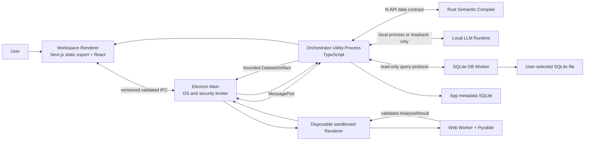
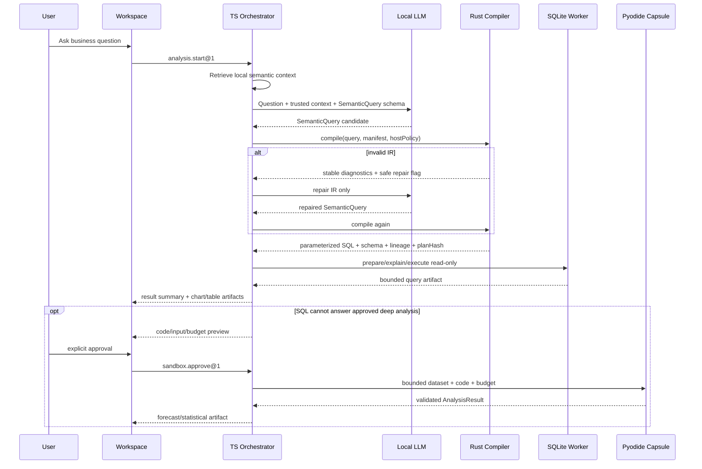

# 技术架构：Semantic Compiler + Local Workspace + Isolated Analysis Capsule

## 架构结论

vNext 采用三个相互隔离的执行域：

1. **Rust Semantic Compiler**：纯确定性核心，通过 N-API 暴露；只接收数据契约，不联网、不打开数据库、不持有凭据。
2. **TypeScript Local Workspace Host**：Electron main + Node utility processes 负责本地 LLM、SQLite、任务调度、持久化、取消、IPC 和打包；Next.js/React renderer 负责 UI。
3. **Pyodide Analysis Capsule**：一次性 sandboxed Electron renderer 内的 Web Worker，运行固定离线 Python/WASM 包；没有 Node、宿主文件、数据库凭据或网络。

这是纯本地桌面架构，不存在 Web/SaaS backend、云 provider adapter、远程队列或多租户控制面。

## 进程与信任边界



### Workspace renderer：不可信展示域

- Next.js 15 App Router 使用静态导出，生产包通过应用自有协议加载，不启动本地 HTTP server。
- Renderer 没有 Node integration、文件系统、数据库、N-API、子进程或凭据能力。
- 所有主机请求都通过窄、版本化、运行时校验的 IPC API。
- LLM 文本、数据库值、Markdown、SQL、日志、图表 spec 都按不可信输入处理。
- 任何外链只能由用户明确操作后交给 OS；应用自身不预取远端内容。

### Electron main：最小 OS broker

- 创建窗口、文件选择器、安全 session、协议、签名资源定位和 utility process。
- 只做权限与生命周期编排，不承载长查询、LLM 推理或 Python 执行。
- 对所有 renderer 权限请求返回 deny，除产品显式允许且可测试的能力。
- 检查 IPC 调用方、schema、run ownership、payload size 和速率。

### Orchestrator utility process：可信本地主机

- 运行 TypeScript 状态机、上下文检索、本地 LLM adapter、Rust N-API binding、DB worker client 和持久化。
- 只有此进程可加载语义 `.node` 模块。
- 只有此进程可访问应用元数据数据库和用户确认的数据源句柄。
- 不把文件路径、凭据或任意 host object 传给 renderer 或分析舱。
- 每个分析由 `runId`、单调 `sequence`、明确 state transition 和 cancellation tree 管理。

### SQLite DB worker：可终止的执行域

- 使用支持只读打开、参数绑定和 `sqlite3_interrupt` 的固定 Node SQLite driver。
- 每个数据源在独立 worker/utility process 中打开；URI 与 flags 强制 read-only。
- 查询取消先调用 driver interrupt；超过 hard-cancel deadline 后销毁 worker 并重建，不允许 UI 停止但 producer 继续。
- 查询前执行 prepare/`EXPLAIN QUERY PLAN`，查询后校验输出 schema、行数、字节与耗时。
- 用户数据数据库与应用元数据数据库永不共用连接。

### Rust Semantic Compiler：无能力纯核心

- 输入：`SemanticQuery@1`、`SemanticManifest@1`、`HostPolicy@1`、目标 dialect 枚举。
- 输出：`CompiledQuery@1` 或结构化 diagnostics。
- 不读取路径、环境变量或时钟；不发网络；不打开数据库；不记录原始数据。
- 同一版本输入必须得到 byte-stable canonical output 与相同 `planHash`。
- N-API adapter 只做序列化、输入上限、panic containment 和错误映射。

### Analysis capsule：不可信代码域

- 每个任务创建新的隐藏 sandboxed renderer 与内存型 session partition。
- Renderer 内再创建 Web Worker；Pyodide 和用户代码只在 Worker 中运行。
- `sandbox: true`、`contextIsolation: true`、`nodeIntegration: false`；preload 只转发固定消息，不暴露通用 IPC。
- CSP 至少包含 `default-src 'none'`，只允许打包的 script/worker/wasm；`connect-src 'none'`。
- Electron session 的 request interception 拒绝所有网络 scheme；permission handler 全拒绝；navigation/window-open 全拒绝。
- 输入是有界 `DatasetArtifact@1` 和 `AnalysisJob@1`；不包含路径、凭据、数据库 handle、任意 JS callback 或 host object。
- 输出只接受 `AnalysisResult@1`；任意 HTML、SVG、二进制可执行内容和未列入允许表的 chart spec 被拒绝。
- 超时、取消、renderer crash、输出超限或协议错误时销毁整个 renderer、session 和虚拟文件系统。

这层是适合单机单用户威胁模型的纵深防御，不是 Firecracker MicroVM。产品文案和 Inspector 必须称其为“隔离分析舱”，不能宣称绝对隔离。

## 生产数据流



### 1. 本地语义检索

- 语义 manifest、字段说明、已确认问题和历史 `SemanticQuery` 存在应用元数据 SQLite。
- 首发检索使用 SQLite FTS5 + 确定性 scope/member ranking；可选本地 embedding 也只能由本地模型计算并存本机。
- 检索结果只包含业务名、描述、类型、允许操作和稳定 ID，不给 LLM 物理 source、公式 AST、连接表达式或 policy 内容。
- “黄金样例”保存 `question + SemanticQuery + manifestRevision`，不保存“黄金 SQL”作为模型输入。

### 2. 本地 LLM

- 默认运行时是应用拥有的本地模型进程，读取用户选择或安装包附带的 GGUF。
- 可选兼容路径只允许 `localhost`、`127.0.0.1` 或 `[::1]` 上的 Ollama；URL 在配置与每次连接时解析并拒绝非 loopback、重定向和代理。
- 没有云 provider interface、API key 字段或任意 base URL。
- 若模型或 schema-constrained generation 不可用，运行失败并给出本地修复动作；不使用规则 planner 生成答案。
- 生成结果必须经过 TypeScript schema validation 和 Rust 编译；最多两次 IR 修复，之后终止并展示 diagnostics。

### 3. 编译与执行

Rust 编译器执行：

```text
wire/schema validation
  -> semantic member resolution
  -> type and operator checking
  -> trusted metric expansion
  -> compiler-selected relationship path
  -> fanout/additivity analysis
  -> host policy injection
  -> private logical plan
  -> structural/cost budgets
  -> parameterized SQLite AST
  -> final read-only allowlist audit
  -> canonical provenance + plan hash
```

TS host 随后执行：

```text
SQLite prepare
  -> EXPLAIN QUERY PLAN budget check
  -> read-only account/file gate
  -> cancellable execution
  -> output schema/row/byte validation
  -> typed artifact persistence
```

## 版本化协议

### `SemanticManifest@1`

可信 manifest 至少包含：

- model stable ID、revision 和 display metadata；
- physical source 映射（永不发给 LLM）；
- dimensions、time dimensions、measures 与类型；
- measure 的可信 typed expression AST 与 aggregation/additivity；
- relationships、keys、cardinality、可选/必选方向；
- scopes/views 暴露的 member allowlist；
- timezone、week start、fiscal calendar 与 null semantics；
- row/member policy AST（由 host context 绑定，不由 LLM提供）。

Manifest 的生成可以由 SQLite introspection 起草，但所有关系、指标和业务名称必须由用户确认后才成为 active revision。

### `SemanticQuery@1`

顶层是 discriminated union：

- `aggregate`：批准指标按批准维度/时间粒度聚合。
- `records`：在 scope 内选择明细字段，必须有严格 limit。
- `comparison`：对两个受限 period/segment 运行同一指标集合，由编译器生成对齐计划。

示例：

```json
{
  "version": "semantic-query@1",
  "kind": "comparison",
  "semanticModel": {
    "id": "commerce",
    "revision": "sha256:manifest"
  },
  "scope": "sales_overview",
  "measures": [
    { "member": "orders.net_profit" }
  ],
  "dimensions": [
    { "member": "region.name" }
  ],
  "periods": [
    {
      "id": "current",
      "timeMember": "orders.ordered_at",
      "start": "2026-06-01T00:00:00+08:00",
      "endExclusive": "2026-07-01T00:00:00+08:00"
    },
    {
      "id": "previous",
      "timeMember": "orders.ordered_at",
      "start": "2026-05-01T00:00:00+08:00",
      "endExclusive": "2026-06-01T00:00:00+08:00"
    }
  ],
  "filters": {
    "operator": "and",
    "items": [
      {
        "member": "region.name",
        "operator": "in",
        "values": [
          { "type": "string", "value": "华东" },
          { "type": "string", "value": "华北" }
        ]
      }
    ]
  },
  "limit": 100
}
```

显式不存在的字段：

- `sql`、`from`、`table`、`column`、`join`、`joinHint`、`on`；
- 指标公式、raw expression、任意 function name；
- dialect、database path、credential、tenant/user/policy claim；
- Python、JavaScript、HTML、CSS 或 chart component 名称。

Filter operator、time grain、sort direction 和 value type 都是闭集枚举。所有值降低为 SQL 参数，不做字符串拼接。

### `CompiledQuery@1`

```ts
type CompiledQueryV1 = {
  version: "compiled-query@1";
  sql: string;
  parameters: ReadonlyArray<TypedParameter>;
  dialect: "sqlite";
  outputSchema: ReadonlyArray<OutputField>;
  lineage: ReadonlyArray<LineageEdge>;
  appliedPolicies: ReadonlyArray<AppliedPolicySummary>;
  costGuard: StructuralBudgetDecision;
  warnings: ReadonlyArray<Diagnostic>;
  compilerVersion: string;
  manifestRevision: string;
  policyRevision: string;
  semanticQueryHash: string;
  planHash: string;
};
```

Diagnostics 必须具有稳定 code、severity、JSON path、候选项和 `safeToRepair`，不包含不必要的物理 Schema 或数据值。

### `ArtifactEvent@1`

Renderer 只消费 allowlisted 事件：

- run lifecycle：`run.started`、`run.progress`、`run.cancelled`、`run.failed`、`run.completed`；
- result：`summary.replace`、`kpis.replace`、`chart.replace`、`table.replace`；
- evidence：`evidence.replace`；
- approval：`approval.requested`、`approval.resolved`。

每个事件含 `runId`、`artifactId`、`sequence`、`operation`、`version`。未知 operation/version、倒序 sequence、超限 payload 或错误 owner 一律拒绝。没有任意 HTML 操作。

### `DatasetArtifact@1` 与 `AnalysisJob@1`

- 数据按列描述：字段 ID、逻辑类型、null bitmap/values；不包含数据库名称和路径。
- 首发默认上限：50,000 行、32 MiB 输入、8 个目标 series；更小的 per-job budget 可以由计划指定。
- Job 包含固定 Python source、固定 package allowlist、seed、timeout、最大输出字节和目标 output schema。
- 用户看到代码、数据行/字节摘要、包列表、timeout 和预期输出后才能批准。

### `AnalysisResult@1`

允许：

- scalar KPI；
- 带类型列的 table；
- allowlisted line/bar/area/scatter chart series；
- 纯文本方法摘要、假设、置信区间和 warnings；
- seed、包版本、duration 和 output hash。

拒绝 HTML、SVG、JavaScript、文件路径、网络 URL、任意 CSS、pickle 和可执行二进制。图表永远由 Workspace renderer 根据已验证 spec 绘制。

## 编译器保证与不保证

### 可证明/强制

- 合约版本、大小、深度和枚举合法。
- 所有 scope/member/grain/operator 都存在且可见。
- 指标依赖无环，表达式与 filter 类型匹配。
- 连接路径来自 manifest，满足声明的 cardinality 与 fanout 规则。
- host policy 注入所有相关计划分支。
- LLM 输入无法携带物理对象、任意函数或 policy claim。
- 最终计划只有允许的只读节点，结构预算未超限。
- 相同固定输入产生相同参数化 SQL、血缘与计划哈希。

### 不可证明

- 指标业务定义、关系基数声明或源数据质量真实无误。
- LLM 选择的业务指标完全符合用户意图。
- 静态成本等于真实执行成本。
- SQLite 数据在运行间未变化。
- Python 模型、预测假设或统计结论具有科学有效性。
- Electron/Pyodide 能提供硬件虚拟化级隔离。

因此每个结果的可信链是：

```text
Schema -> semantic/type/policy compile -> final-plan allowlist
-> SQLite prepare/explain -> read-only execution
-> result bounds -> provenance-bearing artifact
```

## 持久化与重放

应用元数据位于 Electron `app.getPath("userData")` 下的新 vNext profile，使用独立 SQLite 数据库。保存：

- conversations 和 questions；
- semantic manifests 与 revision；
- canonical `SemanticQuery`；
- compiler/policy/model versions；
- `CompiledQuery` 证据（参数敏感值按策略脱敏）；
- result artifact metadata、保存图表与 dashboards；
- analysis code、批准记录、固定包版本、seed 和 output hash；
- append-only run events 与 terminal state。

精确重放必须固定语义修订、IR、compiler 和 policy；若数据源 fingerprint 改变，结果标记为“新数据上的再执行”，不能声称 byte-identical。历史打开只读取 terminal snapshot，不触发自动执行。

## 跨平台路径规范

### TypeScript

所有宿主文件路径必须来自：

- Electron `app.getPath(...)`；
- `process.resourcesPath`；
- 原生 file picker 返回值；
- 明确传入的测试根目录。

组合与检查只能使用 `node:path`：`join`、`resolve`、`relative`、`dirname`、`basename`、`extname`、`normalize`。规则：

- 禁止 `dir + "/" + file`、模板字符串斜杠拼接、按 `/` 或 `\\` split、用正则猜平台。
- Host path 与 URL 分离；文件 URL 使用 `pathToFileURL`/`fileURLToPath`，自有协议使用 `URL`。
- containment 使用 `resolve` + `relative`，并拒绝 `..`、绝对 relative、跨 drive、UNC escape；已有路径在安全判断前使用 `realpath` 防 symlink escape。
- 业务标识使用 `/` 只作为协议分隔符时必须是命名明确的 ID/URL，不得被当作 host path。
- 日志通过 basename 或脱敏 alias 展示，不默认输出用户绝对路径。

### Rust

- API 内部使用 `&Path`、`PathBuf`、`&OsStr`、`OsString`；组合只用 `PathBuf::push`/`Path::join`。
- 禁止 `format!("{}/{}")`、字符串 `split('/')`、手写 drive/UNC 解析或为了逻辑 round-trip 调用 `to_string_lossy()`。
- `canonicalize`/component walk 用于 containment；错误显示可以 lossy，逻辑比较不能 lossy。
- 纯语义编译器不接收路径；只有 binding loader/packaging helper 可能接触资源路径。

### 必测路径矩阵

- macOS：空格、中文、emoji、组合/分解 Unicode、深层路径、只读目录、symlink escape。
- Windows：空格、中文、Unicode、盘符大小写、不同盘符、UNC、长路径、保留名、只读目录、junction/symlink escape。
- 两端：临时目录、用户数据目录、安装路径、模型路径、SQLite 路径、Pyodide 资源路径、`.node` 路径。

静态 lint 阻断明显字符串路径拼接；动态测试证明真实路径行为。静态 lint 不能替代 Windows 运行测试。

## 本地网络策略

- 默认拒绝所有 renderer 与分析舱网络。
- Orchestrator 只能访问显式启用的 loopback 本地模型；拒绝 DNS host、非 loopback IP、redirect、proxy env 和 Unix socket 之外的远程目标。
- SQLite 首发只打开用户选择的本地文件，没有远程数据库连接。
- 不集成遥测、崩溃上传、远程配置、Vercel Analytics、CDN 字体、云更新或内容预览。
- 依赖安装和 GitHub Actions 属于开发/发布供应链，不是产品运行时能力；发布包必须在断网状态下完整工作。

## UI 技术栈与边界

- Next.js 15 App Router，生产 `output: export`；不使用 Server Actions/API routes 作为产品 runtime。
- React 19、TypeScript strict、Tailwind CSS 4。
- shadcn/ui v4，Radix base，仅逐组件加入。
- Recharts 3 通过自有 chart adapter；所有 chart 开启 accessibility layer 并有 table fallback。
- `motion` 单包，`LazyMotion` + `m`，尊重 reduced motion。
- 本地 Geist Sans/Mono。
- Zod/JSON Schema 在 IPC、event、artifact 和 sandbox 边界做运行时校验。
- 不接受 LLM 控制的 component 名称、CSS、颜色、HTML 或 import。

可见行为见 [UI-SPEC.md](./UI-SPEC.md)。

## 发布与 CI 架构

### 第一个提交的强制矩阵

第一段实现是 N-API `hello()`，同一提交必须新增 CI 并运行：

| Target | 运行要求 | 产物证明 |
|---|---|---|
| `aarch64-apple-darwin` | 在 arm64 macOS runner 上编译并由同架构 Node `require/import` | `.node` 架构检查、返回固定 ABI/version payload |
| `x86_64-apple-darwin` | 在 Intel macOS runner 上编译并由同架构 Node 加载 | 同上 |
| `x86_64-pc-windows-msvc` | 在 Windows x64 runner 上 MSVC 编译并由 Node 加载 | `.node` 加载、路径含空格/中文 smoke |

Runner label 会随 GitHub 供应变化，因此 workflow 必须把“目标 triple、runner 实际架构、Node/Electron ABI”打印并断言；不能把某个 label 名称当成证据。交叉编译成功不能替代目标机加载。

### 每个 PR 的轻量门

- TypeScript typecheck/lint 与路径拼接 lint。
- Rust fmt/clippy 和受影响 crate tests。
- `SemanticQuery` schema corpus 与 compiler golden/negative tests。
- 三目标 N-API build + load smoke。
- Next static export 与资产网络扫描。
- 受影响平台的 Electron unpackaged smoke；安装包/签名矩阵可在 release workflow 执行。

### 发布门

- macOS arm64/x64 安装包（可另产 universal）及签名/公证验证。
- Windows x64 installer、Authenticode 与 SmartScreen/卸载检查。
- `.node`、Pyodide、wheels、Geist、Next assets 位于明确资源目录；需要的 native 文件不困在 ASAR 内。
- SBOM、第三方 notices、artifact checksums、签名与可复现依赖锁。
- 干净 macOS arm64、macOS Intel、Windows x64 环境完成断网端到端流程。

### 本地开发热量策略

开发者本机默认运行静态检查和受影响测试；三平台全量构建、打包、安装与大语料由 CI 承担。任何本地未运行项必须由对应 CI job 提供同一 commit 的证据。

## 故障语义

- **模型不可用**：停止，显示选择本地 GGUF/启动本地模型的操作；不降级到无 LLM 回答。
- **IR 无效**：最多两次结构化修复；失败后显示业务语言诊断与 Inspector 细节。
- **编译拒绝**：不执行；显示未知成员、fanout、策略或预算原因。
- **DB prepare/explain 拒绝**：不执行；保留已编译证据和可修复建议。
- **取消**：终止 LLM producer、Rust task（若异步）、DB worker 或分析舱；terminal state 只写一次。
- **分析舱失败**：保留 SQL 结果；Python artifact 显示局部失败，不把不完整预测写成结论。
- **历史损坏/版本不兼容**：只读显示可恢复信息；不自动修改或重跑。
- **native addon 缺失/架构错误**：应用 doctor 阻止分析并显示目标 triple 与资源检查，不加载 JS 规则替代编译器。
