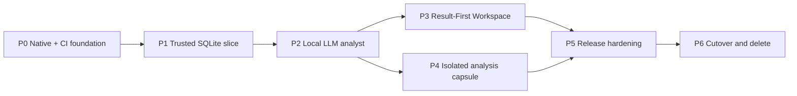

# Clean-room vNext 纵向交付路线图

## 交付原则

1. 每个阶段交付一个从用户动作到可见结果、错误与证据的纵向切片；不按“先写完后端、再做前端”分层堆积。
2. P0 的跨平台 N-API 与 CI 是第一段实现，不等功能写完再补。
3. macOS arm64、macOS x64、Windows x64 是同一个首发范围；任一平台缺失，阶段不能宣称跨平台完成。
4. 本地只跑静态检查和少量受影响验证；构建、全矩阵和安装包证据交给 CI。
5. 每个阶段只在 `vnext/` 新工程工作，不读取、包装、导入或微调旧实现。
6. 在 P6 切换前不删除旧实现，避免失去可回退产品；通过 P6 gate 后必须删除，不保留双运行时。
7. 没有云端“下一阶段”。首发之后的功能仍必须在纯本地边界内重新立项。

## 建议的新工程边界

```text
vnext/
  apps/
    desktop/                 Electron main, preload, packaging
    workspace/               Next.js static renderer
  packages/
    contracts/               TS schemas and generated types
    orchestrator/            local LLM, run state machine, DB client
    artifacts/               renderer allowlist and persistence contracts
    design-system/           tokens and selected shadcn primitives
    path-policy/             path helpers, lint rules and fixtures
  crates/
    semantic-contract/       serde types and generated JSON schemas
    semantic-compiler/       manifest, private plan, policy, lowering
    semantic-napi/           narrow Node-API adapter
  assets/
    fonts/                    local Geist
    pyodide/                  pinned runtime and wheels
  docs/                       this specification set
  evidence/                   generated, commit-addressed evidence only
```

这是目标结构，不是旧目录迁移表。每个 package 必须有单一职责和显式 public API；renderer 不依赖 host-only packages。

## P0 — Clean-room shell 与跨平台原生地基

### 用户/产品价值

还没有分析功能，但它证明最昂贵的架构风险——Electron、Next static renderer、Rust N-API 和三目标打包边界——从第一天就可持续。后续任何提交都不能在 Windows 或任一 Mac ABI 上悄悄失效。

### 实现范围

1. 初始化独立 pnpm workspace、Cargo workspace、lockfiles 和 TypeScript strict config。
2. 创建 Electron native-frame 窗口，加载 Next.js 15 App Router static export 的空 Workspace shell。
3. 创建纯 Rust `semantic-core` 与 `semantic-napi`；第一个 API 为：

   ```ts
   hello(): {
     contract: "semantic-napi@1";
     target: string;
     compilerVersion: string;
   }
   ```

4. Electron orchestrator utility process 加载 `.node` 并把只读 doctor payload 通过版本化 IPC 发送给 renderer。
5. 建立目标 matrix：
   - `aarch64-apple-darwin`
   - `x86_64-apple-darwin`
   - `x86_64-pc-windows-msvc`
6. 每个 job 在对应真实架构 runner 上编译，并由目标 Node/Electron 实际加载 addon；打印并断言 runner arch、Rust triple、Node ABI。
7. 将三个 native checks、TS typecheck/lint、Rust fmt/clippy、path-policy lint 设为 required checks。
8. 加入 TypeScript/Rust 路径反模式 fixtures，证明 lint 会因手写斜杠拼接而失败。
9. 建立 third-party adoption manifest、notices/SBOM 生成骨架和调研 clone 排除规则。

### 明确不做

- 不接 LLM、数据库或 Python。
- 不复制完整模板或旧 UI。
- 不用 cross-compile 成功代替目标 Node load。
- 不为了让 Hello World 通过而提供 JS fallback。

### Exit gate

- CI-01–08/10 全部绿色。
- 三个目标的 `hello()` payload 和 `.node` architecture evidence 被保存。
- 空 Workspace 在 macOS arm64/x64、Windows x64 unpackaged smoke 中可见。
- 手写路径拼接 fixture 在 TS 与 Rust 两边都能让 CI 变红。

若任何目标无法获得真实架构 runner，P0 保持未完成；不能先继续开发后补。

## P1 — 第一条可信本地查询链

### 用户/产品价值

用户选择一个本地 SQLite 文件，确认一个最小语义模型，并在开发态选择一条受控示例意图；系统通过 Rust 编译、只读执行，最后在 Result Canvas 显示 KPI、图表、表格和证据。这证明“数据→语义→编译→执行→结果”主干成立。

该阶段的受控示例意图只是开发/测试 harness，不作为“无 LLM 模式”出现在发布产品；P2 用真实本地 LLM 替换入口。

### 实现范围

1. 原生 file picker 选择 SQLite；路径只通过 path policy API。
2. 独立 DB worker 以 read-only flag 打开文件，完成受限 introspection。
3. 新用户 profile 中保存 draft manifest；UI 让用户确认 entity、time field、measure 和 relationship 后才创建 active revision。
4. 在 contract-first 顺序下实现：
   - `SemanticManifest@1`
   - `SemanticQuery@1`
   - `HostPolicy@1`
   - `CompiledQuery@1`
   - diagnostics
5. 建立代表性 corpus：单指标、分组、时间、对比、records、one-to-many、many-to-many、null、timezone、未知成员、raw SQL、任意函数、policy 注入与预算攻击。
6. Rust compiler 做成员/类型/指标/关系/fanout/policy/private plan/parameterized SQLite lowering/final allowlist/plan hash。
7. TypeScript host 执行 prepare、EXPLAIN budget、read-only query、interrupt、schema/row/byte checks。
8. Renderer 交付新的 Canvas shell：summary placeholder（来自确定性模板，不是伪 LLM 结论）、KPI、primary chart、table、takeaway、table alternative、Evidence strip。
9. 加入 SQLite 长查询 cancel 与 hard-kill worker fallback。

### 引擎选择 gate

在写 shipping compiler 前，用同一 corpus 做一个短、隔离的 adapter spike：

- QueryGPT-owned minimal private plan/lowering；
- pinned Wren/DataFusion adapter。

比较 native addon 大小、三平台 build 时间、contract fit、fanout/policy coverage、diagnostic ownership 和上游类型泄漏。无论结果如何，产品 ABI 始终是自有 contract/trait。若上游 adapter 不能在不暴露 modeled SQL/上游 types 的前提下明显减少风险，shipping path 采用更小的自有 compiler。Spike 不进入 release package。

### Exit gate

- SEM-01–20、DAT-01–11、UI-01/11–13、相关 PTH/SEC 需求有运行证据。
- 恶意 IR 不能携带 SQL、physical member、join、formula、function、policy 或 dialect。
- 相同固定输入在三个 native target 上得到相同 canonical output 与 plan hash。
- Windows 中文/空格/UNC/长路径和 macOS Unicode/symlink matrix 通过。
- 真实 SQLite 长查询 Stop 后 producer 不继续。

## P2 — 本地 LLM 可信分析闭环

### 用户/产品价值

用户用自然语言提问，本地 LLM 生成受限 IR；失败可结构化修复，成功结果流式进入 Canvas，技术证据在 Inspector 按需可见。重启应用后历史结果仍在，不会自动重跑。

### 实现范围

1. 集成本地 model runtime：app-owned GGUF runner；可选严格 loopback Ollama。
2. 语义上下文使用本地 FTS/ranking，只暴露 scope/member 业务元数据。
3. 使用 JSON Schema constrained generation（运行时支持时）并始终做 runtime validation。
4. 实现最多两次的 diagnostics-guided IR repair；模型永远看不到生成 SQL。
5. 建立显式 run state machine、cancellation tree、terminal commit CAS 和 append-only events。
6. 定义 `ArtifactEvent@1` allowlist，支持 run lifecycle、summary/KPI/chart/table/evidence replace 与 approval events。
7. Summary 只能在 DB 数据与 compile evidence 完成后生成；事实、推断、预测标签明确。
8. 实现 Result-shaped skeleton、业务 timeline、始终可见 Stop 和可恢复 error cards。
9. 实现默认关闭的 Inspector：Semantic、SQL、Lineage、Timing。
10. 保存 terminal snapshot、versions、IR、plan hash 与 data fingerprint；重启只读恢复。
11. 实现 exact replay 条件判断与 current-data rerun 区分。
12. 删除/关闭 P1 的任何用户可见 dev harness；生产自然语言入口没有无 LLM 模式。

### Exit gate

- 一个本地模型在断开外网情况下完成代表性问题。
- 模型关闭、非法输出、两次修复失败、compile 拒绝、DB 拒绝、取消和重启状态均有 E2E。
- Stop 实际终止 LLM producer 和 DB worker。
- 历史打开没有 LLM/DB side effect。
- Inspector 默认关闭，业务 Canvas 无 raw IR/SQL/log。
- LOC-04/07–10、LLM、ORC、ART-01–06 和对应 UI/SEC 全部通过。

## P3 — 完整 Result-First Workspace

### 用户/产品价值

产品从单次回答升级为工作区：用户能导航历史、保存图表和看板、从图表钻取、用 Cmd/Ctrl+K 操作，并在不同窗口宽度、主题与输入方式下保持完整体验。

### 实现范围

1. Library Sidebar：Recent、Dashboards、Saved charts、Data sources、Semantic model。
2. Conversation Rail 与 Canvas keyboard-resizable；Canvas 可独立阅读。
3. Cmd/Ctrl+K command palette，macOS/Windows 键位一致但显示符合平台。
4. Drill-down menu 把选中 mark 的 semantic context 变成结构化 intent，再走正常 LLM→IR→compile 链。
5. 保存图表持久化 artifact spec/provenance；简单 grid dashboard 引用 saved versions。
6. 历史 snapshot 的 stale/current-data 状态与明确 refresh。
7. 320/390 responsive：Canvas primary、Conversation/Library/Inspector Sheets、无 document 横向溢出。
8. 200% zoom、keyboard-only、screen-reader landmarks、focus restore、chart table alternative。
9. Light/dark、高对比和 reduced-motion。
10. Motion 只用于 Canvas entry、Inspector、skeleton 和小状态；一个 `motion` package、一个 Recharts engine。
11. 完成 empty/loading/success/partial/error/cancelled/stale 状态截图矩阵。

### Exit gate

- 用户能完全用键盘完成 open data→ask→inspect→drill→save dashboard。
- macOS 与 Windows Cmd/Ctrl+K、分隔条、Sheets 和 native menu 通过。
- 320、390、desktop、200% zoom 无关键内容丢失或页面双向滚动。
- 每张图有 takeaway 和 table alternative；严重 a11y 缺陷为 0。
- ART-07–09、UI-02/03/05/08/09/14–19/23、SEC-07 通过。

## P4 — 明确授权的本地深度分析

### 用户/产品价值

当 SQL 无法完成预测或统计分析时，用户能看到完整代码、输入和资源预算，批准一次本地运行，并在失败时保留已有 SQL 结果。代码不触及宿主 Python、文件、数据库或网络。

### 实现范围

1. 定义 `DatasetArtifact@1`、`AnalysisJob@1`、`AnalysisResult@1` 与攻击 corpus。
2. 固定 Pyodide、pandas/科学计算 wheels 和 hashes，全部随安装包离线分发。
3. 创建一次性 hidden sandboxed renderer、内存 session 和内部 Web Worker。
4. 双层网络拒绝：CSP `connect-src 'none'` + Electron request interception；permission/navigation/window-open 全拒绝。
5. Approval Card 展示完整 source、列/行/字节、包版本、timeout、seed、output cap；每次 run 单独批准。
6. source/data hash 变化立即让批准失效。
7. 数据不含 path/credential/DB handle；Python 只能看到 bounded dataset 和虚拟 FS。
8. timeout/Stop/crash/output overflow 直接销毁 renderer/session/virtual FS。
9. 只接收 allowlisted scalar/table/line/bar/area/scatter/text evidence；拒绝 HTML/SVG/JS/pickle/path。
10. Canvas 标识历史事实与预测；显示方法、假设、置信区间和 warnings。
11. Inspector 新增 Sandbox tab，展示批准和 execution evidence。

### Exit gate

- 正常预测在三目标安装环境中断网完成。
- `fetch`、WebSocket、动态包安装、Node、host file、credential、无限循环、超大输出和恶意 HTML/SVG payload 全部被拒绝/终止。
- Stop/timeout 后 renderer 与 session 不存在，下一次运行是全新环境。
- Python 失败不破坏 SQL result。
- SBX-01–15 与 UI-07 通过。

## P5 — 三平台发布级硬化

### 用户/产品价值

用户得到真正可安装、签名、断网、可卸载的 macOS/Windows 产品，而不是只能在开发机启动的 demo。

### 实现范围

1. 固定 Electron/Node、Rust toolchain、Pyodide/wheels、Next/UI dependencies 和 lockfiles。
2. 配置 ASAR/resource 边界，确保 `.node`、Pyodide/WASM/wheels、字体和模型 runtime 位于可加载、可签名位置。
3. macOS arm64/x64 构建、codesign、notarization、Gatekeeper 验证；可额外产 universal artifact，但不替代两个 ABI load tests。
4. Windows x64 installer、Authenticode、SmartScreen 基本检查与干净卸载。
5. 生成 checksums、SBOM、third-party notices 和 package file manifest。
6. 三平台干净机断网 install→first use→query→save→sandbox→restart→uninstall。
7. runtime 网络捕获、proxy env、redirect、remote asset、telemetry 与 crash upload 负向测试。
8. 真机路径 matrix、UI 截图、keyboard、200% zoom、dark、reduced-motion。
9. 性能预算：首个状态事件、Canvas 首内容、取消响应、idle memory、package size；超限必须有 profile 与决策。
10. 故障注入：addon 缺失/错架构、模型损坏、SQLite 只读/锁定、metadata crash、capsule crash、磁盘满。

### Exit gate

- PLT、LOC-01–03/06、CLR-06、SBX-09/16、SEC-09/10、CI-11–14 全部通过。
- 三目标证据来自同一 release commit。
- 安装包不依赖 Node、Python、字体或服务的宿主安装。
- 发布包在断网下完成北极星工作流。
- UI-SPEC 的视觉/可访问性矩阵在真实安装包通过。

## P6 — Cutover、删除与单一路径证明

### 用户/产品价值

重建正式取代旧产品，仓库和发布流程只剩一个可理解、可维护、可验证的产品，不再承担永久双实现成本。

### Entry gate（删除前）

1. 对 [REQUIREMENTS.md](./REQUIREMENTS.md) 每个 MUST 做逐项 completion audit。
2. 所有证据指向当前候选 commit，而不是早期 snapshot。
3. P0–P5 required checks 和三目标安装包全部绿色。
4. 北极星工作流、错误流、取消、重启、沙箱攻击和视觉矩阵均有真实证据。
5. 用户确认接受“vNext 新 profile、无旧数据迁移”的产品边界。

任何一项缺失都不删除，也不把项目标记完成。

### Cutover 操作

1. 把唯一产品入口、文档和 release workflow 指向 vNext。
2. 删除旧实现源码、旧 package entries、旧 assets、旧运行脚本和旧 CI jobs。
3. 删除所有 compatibility wrapper、feature flag、fallback 和旧 profile reader。
4. 重新生成 lockfile、SBOM、notices 和 package file manifest。
5. 在删除后的同一 commit 重新跑三平台全 required checks、安装包和断网北极星 E2E。
6. 审计仓库只存在一个 desktop entry、一个 semantic compiler、一个 artifact protocol、一个 UI system 和一个 release path。

### 明确不是迁移

- 不转换旧数据库。
- 不导入旧历史、设置、连接或缓存。
- 不提供“兼容模式”。
- 不在第一次启动扫描旧 profile。
- 不保留旧二进制供新 UI 调用。

### Exit gate

- CUT-01–07 全部通过。
- 删除后 CI 与安装包仍通过，且 package graph 没有旧依赖。
- 当前仓库与发行物中只有一个产品运行路径。
- Completion audit 没有 `unknown`、`partial` 或仅静态推断的 MUST 条目。

满足以上条件后，重建目标才可以标记完成。

## 阶段依赖图



P3 与 P4 可在 P2 后并行，但 P5 必须同时接收两者。P6 永远是最后一步。

## 每阶段交付记录模板

每个 phase 结束时记录：

```text
Phase:
Commit:
Requirements proven:
Requirements missing/contradicted:
macOS arm64 checks:
macOS x64 checks:
Windows x64 checks:
Focused local checks:
CI URLs/artifact hashes:
Real UI screenshots:
Security/failure evidence:
Known limits:
Decision: pass | fail
```

`pass` 只能由当前证据得出；不能因为“下一阶段会补”而通过当前硬门。
